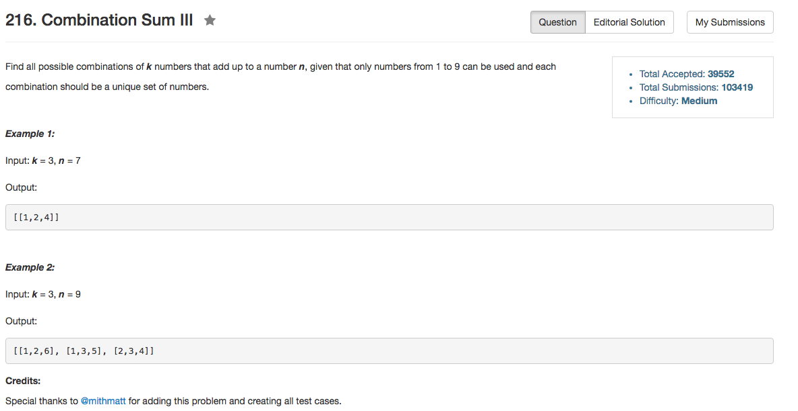

## Algorithm 

- 这道题就是回溯咯，而且这道题目非常简单的地方在于，解空间非常小
- 因为要求所有的解是1-9，而且还不能有重复的数组，所以结果顶多就是2^9种可能：任何一个数字只有选择或者不选择两种状态。
- 于是就按照选不选某一个数字，直接回溯就好了。

## Comment

- 一种回溯有不同的写法，关键还是要好好写程序。

## Code


```C++
class Solution {
public:
    vector<vector<int>> combinationSum3(int k, int n) {
        DFS(1, k, n);
        return result;
    }
private:
    vector<vector<int>> result;
    vector<int> tmpResult;
    void DFS(int current, int k, int n){
        if (k == 0 && n == 0){
            result.push_back(tmpResult);
        } else if (k > 0 && n > 0 && current <= 9){
            DFS(current + 1, k, n);
            tmpResult.push_back(current);
            DFS(current + 1, k - 1, n - current);
            tmpResult.pop_back();
        }
    }
};
```