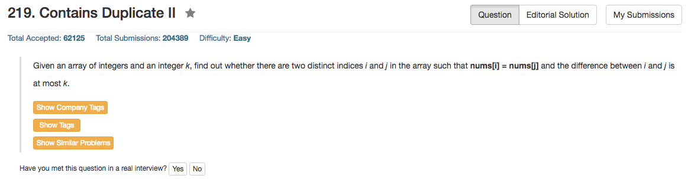

## Algorithm 

- 其实这个跟之前的Container Duplicate很相似，唯一不同的就是对duplicate的距离有限制。
- 这个限制很容易解决：
    1. 如果Hashmap不记录位置，那么就是每次迭代之后，`i - k + 1`这个值从Hashmap里面删除，这样就能保证Hashmap里面只有`距离<=k`的元素。
    2. 如果Hashmap记录了位置，那么每次就直接判断hashmap找到的值的位置是不是在k的距离以内；另外，如果当前元素出现在了hashmap里面，就用当前的位置代替以前的位置，这样将来的可能的重复的元素就更有可能满足条件。

## Comment

- 这个题目仍然要注意的是不同的语言，不同数据结构，不同操作的时间复杂度
- C++的信息来自[Cplusplus](http://www.cplusplus.com/)这个网站
    1. `unordered_map`: [Reference](http://www.cplusplus.com/reference/unordered_map/unordered_map/)
        - `find: ` _Average case_: constant; _Worst case_: linear in container size.
        - `erase:` _Average case_: Linear in the number of elements removed (which is constant for versions (1) and (2)); _Worst case_: Linear in the container size.
        - `[] / insert:` _Average case_: constant; _Worst case_: linear in container size.
    2. `unordered_set`: [Reference](http://www.cplusplus.com/reference/unordered_set/unordered_set/)
        - `find:` _Average case_: constant; _Worst case_: linear in container size.
        - `erase:` _Average case_: Linear in the number of elements removed (which is constant for versions (1) and (2)); _Worst case_: Linear in the container size.
        - `[] / insert: (1) Single element insertions: _Average case_: constant; _Worst case_: linear in container size. (2) Multiple elements insertion: _Average case_: linear in the number of elements inserted; _Worst case_: N*(size+1): number of elements inserted times the container size plus one.

## Code

```c++
class Solution {
public:
    bool containsNearbyDuplicate(vector<int>& nums, int k) {
        std::unordered_map<int, int>hashMap;
        for (int i = 0; i < nums.size(); i++){
            if ( (hashMap.find(nums[i]) != hashMap.end()) && (i - hashMap[nums[i]] <= k) ){
                return true;
            } else {
                hashMap[nums[i]] = i;
            }
        }
        return false;
    }
};
```