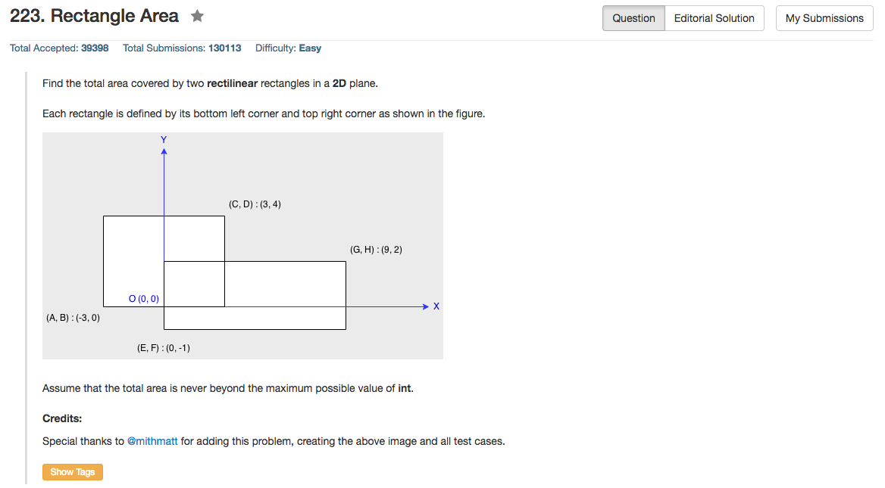

## Algorithm 

- 这个题目很简单，但是也还是有点小麻烦。基本的思路就是`两个矩形面积 - 重叠面积`。
- 关键就是在于重叠面积怎么计算，搞得不好就会非常琐碎。这里用的方法是：
    - 如果两个矩形的确重叠了：重叠面积的左下角应该是两个矩形的左下角的坐标的最大值；重叠面积的右上角应该是两个矩形的右上角的坐标的最小值。
    - 万一两个矩形没重叠：其实还是可以用上述方法计算，但是这个时候就会发现_新的左下角_不在_新的右上角_的**左下角**，也就是说不存在这样的矩形。那就让重叠面积为0好了。

## Comment

- 这个题目非常容易写的非常琐碎，想复杂了就会要判断：A在B左下，A在B左上，B在A左下，B在A左上，等等，非常麻烦。

## Code


```c++
class Solution {
public:
    int computeArea(int A, int B, int C, int D, int E, int F, int G, int H) {
        int area1 = (D - B) * (C - A);
        int area2 = (H - F) * (G - E);
        int Lx = max(A, E), Ly = max(B,F), Rx = min(C,G), Ry = min(D,H);
        int intersect = (Lx < Rx && Ly < Ry) ? (Rx - Lx) * (Ry - Ly) : 0;
        return area1 + area2 - intersect;
    }
};
```