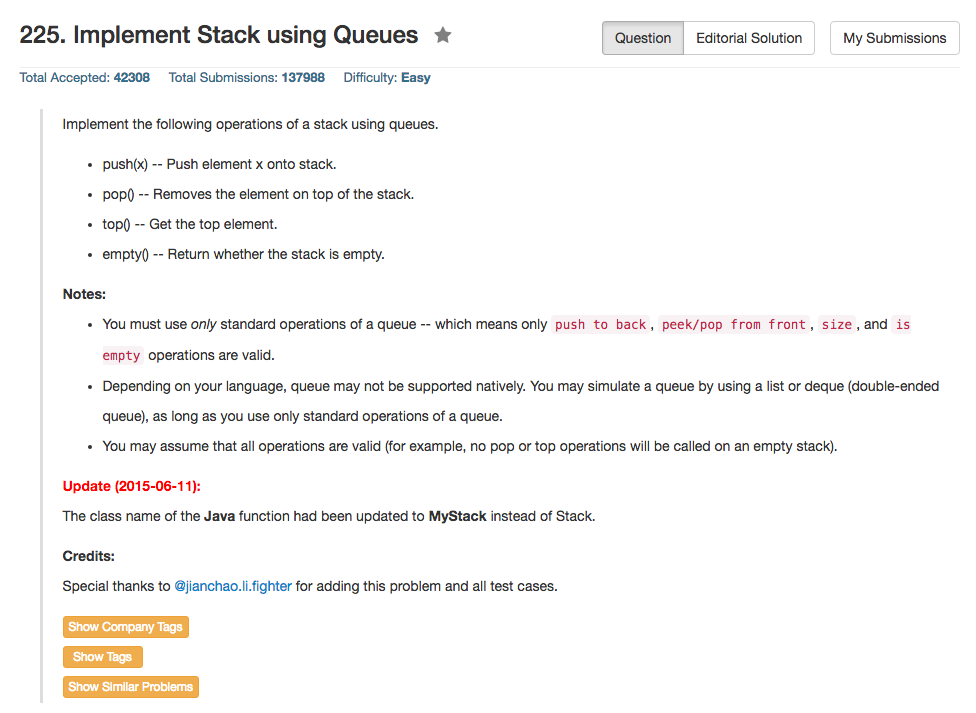

## Algorithm 

- 最后解法的算法来自[这里](https://leetcode.com/discuss/39814/concise-1-queue-java-c-python)。我一开始想这个问题想错了，结果写出来的算法也是错的。
- 这个解法的基本思路就是每次push一个新的元素之后，整个queue就旋转一遍，也就是把当前的queue从队尾到队首依次出队列再重新进入队列，经过这样一个操作之后，能够保证每一次push的元素实际上总是在队尾，而且因为整个队列已经颠倒过来了，所以top, pop都是直接访问就好了。

## Comment

- 这个题目还满好玩的，一开始并没有想到正确的解法也是蛮遗憾的。

## Code

```c++
class Stack {
    queue<int> myQueue;
public:
    // Push element x onto stack.
    void push(int x) {
        myQueue.push(x);
        for (int i = 1; i < myQueue.size(); i++) {
            myQueue.push(myQueue.front());
            myQueue.pop();
        }
    }

    // Removes the element on top of the stack.
    void pop() {
        myQueue.pop();
    }

    // Get the top element.
    int top() {
        return myQueue.front();
    }

    // Return whether the stack is empty.
    bool empty() {
        return (myQueue.empty());
    }
};
```