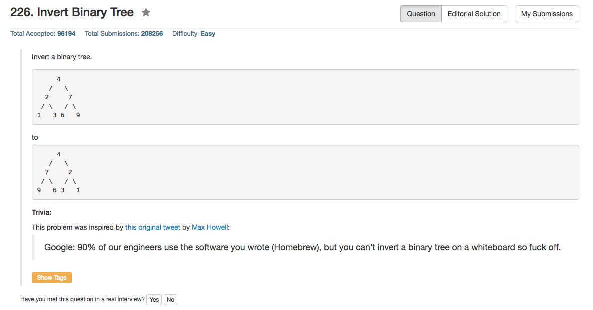

## Algorithm 

- 递归直接搞，没什么好说的。

## Comment

- 这个题目倒是要注意一下Python在写swap的时候的风骚的语法`a, b = b, a`直接搞定。
- 边界条件一定要注意，就是当root是空集的时候。

## Code

```C
/**
 * Definition for a binary tree node.
 * struct TreeNode {
 *     int val;
 *     struct TreeNode *left;
 *     struct TreeNode *right;
 * };
 */
struct TreeNode* invertTree(struct TreeNode* root) {
    struct TreeNode * tmp;
    if (root){
      root->left = invertTree(root->left);
      root->right = invertTree(root->right);
      tmp = root->left;
      root->left = root->right;
      root->right = tmp;
    } 
    return root;
}
```
<hr>

```Python
# Definition for a binary tree node.
# class TreeNode:
#     def __init__(self, x):
#         self.val = x
#         self.left = None
#         self.right = None

class Solution:
    # @param {TreeNode} root
    # @return {TreeNode}
    def invertTree(self, root):
        if root != None:
            self.invertTree(root.left);
            self.invertTree(root.right);
            root.left, root.right = root.right, root.left
        return root
```

<hr>

```Ruby
# Definition for a binary tree node.
# class TreeNode
#     attr_accessor :val, :left, :right
#     def initialize(val)
#         @val = val
#         @left, @right = nil, nil
#     end
# end

# @param {TreeNode} root
# @return {TreeNode}
def invert_tree(root)
    if !root.nil? 
        invert_tree(root.left)
        invert_tree(root.right)
        root.left, root.right = root.right, root.left
    end
    root 
end
```