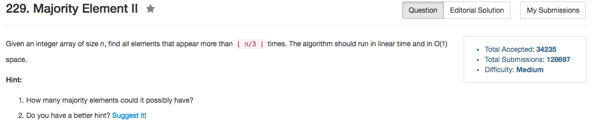

## Algorithm 

- 我又写的巨长无比。
- 我的想法很简单，就是保存3个数，如果新的数是三个数之一，那么就把对应的计数次数加一。如果新的数不是三个数中的任何一个，那么把当前出现频率最低的那个替换掉，并且设定出现次数是1。——现在想起来好像这个操作有点冗余而且不一定是合理的，比如[1,2,3,1,2,3,4,1]。但是由于最后我又把所有的candidate扫了一遍，这个算法可以确保的是正确的答案一定是candidate
- 网上说了用majority vote的算法，比如[这里](https://discuss.leetcode.com/topic/17564/boyer-moore-majority-vote-algorithm-and-my-elaboration)的Python程序，和[这里](https://discuss.leetcode.com/topic/23689/my-o-n-time-solution-20ms/2)的C++程序
    - 基本思路跟我上面的思路一样，但是只要记录两个（而不是三个）元素就好了。
    - 如果新的元素等于两个中的一个，对应计数加一
    - 如果新的元素不等于两个中的任何一个，两个计数器都减一
    - 接上，如果有一个计数器是0了，那么对应的元素设定为当前的元素，并且计数器设定为1.
    - 最后再统计一遍两个元素有哪个出现的次数超过了`floor(n / 3)`

## Comment

- 二叉树一般都用递归比较好解决

## Code

```C++
class Solution {
public:
    vector<int> majorityElement(vector<int>& nums) {
        int maxCount = 3;
        vector<int> value, count, result;
        int size = nums.size();
        for (int i = 0; i != size; i++){
            bool addNew = true;
            int minIndex = 0, minCount = INT_MAX;
            for (int j = 0; j < value.size(); j++) {
                if (nums[i] == value[j]) {
                    count[j]++;
                    addNew = false;
                }
                if (count[j] < minCount){
                    minCount = count[j];
                    minIndex = j;
                }
            }
            if (addNew){
                if (value.size() < maxCount) {
                    value.push_back(nums[i]);
                    count.push_back(1);
                } else {
                    value[minIndex] = nums[i];
                    count[minIndex] = 1;
                }
            }
        }
        for (int j = 0; j != count.size(); j++){
          count[j] = 0;
          for (int i = 0; i < size; i++){
              count[j] += (nums[i] == value[j]);
          }
        } 
        for (int i = 0; i != value.size(); i++){
            if (count[i] > size / 3) {
                result.push_back(value[i]);
            }
        }
        return result;
    }
};
```

这里只摘录[这里](https://discuss.leetcode.com/topic/17564/boyer-moore-majority-vote-algorithm-and-my-elaboration)写的很好的Python版本，另外一个参考写的C++版本写的不是很美。

```Python
class Solution:
# @param {integer[]} nums
# @return {integer[]}
def majorityElement(self, nums):
    if not nums:
        return []
    count1, count2, candidate1, candidate2 = 0, 0, 0, 1
    for n in nums:
        if n == candidate1:
            count1 += 1
        elif n == candidate2:
            count2 += 1
        elif count1 == 0:
            candidate1, count1 = n, 1
        elif count2 == 0:
            candidate2, count2 = n, 1
        else:
            count1, count2 = count1 - 1, count2 - 1
    return [n for n in (candidate1, candidate2)
                    if nums.count(n) > len(nums) // 3]
```
