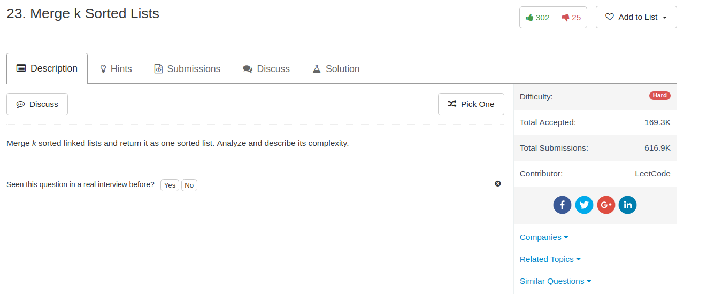

## Algorithm

- 这个题目其实不难，就是维护一个priority queue(或者heap)就好了。一开始把所有的表头进入这个heap，然后每一次取出最小值之后，如果这个node还有下一个借点，就把下一个节点放入这个heap里面
- 时间复杂度的话应该是O(Nlog(K))，其中N是所有节点个数的总和，而K是list的个数

## Comment

- 主要开始要了解语言自带的Data Structure
- python里面`from Queue import PriorityQueue`其中支持`put`和`get`
- python里面还有`import heapq`其中支持`heappush, headpop`
- 最后，可以添加tuple来调整优先级，所以入堆我用的是`(node.val, node)`

## Code


```python
from Queue import PriorityQueue
class Solution(object):
    def mergeKLists(self, lists):
        """
        :type lists: List[ListNode]
        :rtype: ListNode
        """
        q = PriorityQueue()
        ans, p = None, None
        for l in lists:
            if l is not None:
                q.put((l.val,l))
        while not q.empty():
            _, node = q.get()
            if ans is None:
                ans, p = node, node
            else:
                p.next = node
                p = node
            if node.next is not None:
                q.put((node.next.val, node.next))
        return ans
```
