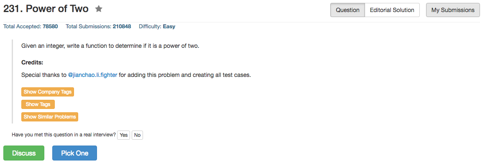

## Algorithm 

- 这个题目倒是有很多解，最容易想的就是写一个循环每一位判断一下，当然这个就比较慢了。
- 最快最简洁的是`n & (n-1)`这个技巧：只有当n是2的幂的时候，这个表达式才为0。
- 另外一个方法就是找到一个更大的整数，比如2^32：只有n是2的幂的时候，`2^32 % n == 0`才成立。

## Comment

- 熟悉位操作咯
- 要注意的是输入可以是非正数，但是题目看来是假设只有正数是2的幂，不过这的确也符合定义。我觉得在面试的时候如果不确定的话也还是可以跟面试官讨论一下吧——虽然结果会显得很傻。

## Code

```c
bool isPowerOfTwo(int n) {
    return (n > 0 && (1L<<32) % n == 0);
}
```
<hr>

```ruby
def is_power_of_two(n)
   return n > 0 ? n & (n-1) === 0 : false
end
```

```ruby
def is_power_of_two(n)
    ans = 0
    while n > 0 do ans += n & 1; n = n >> 1; end
    return ans === 1
end
```
