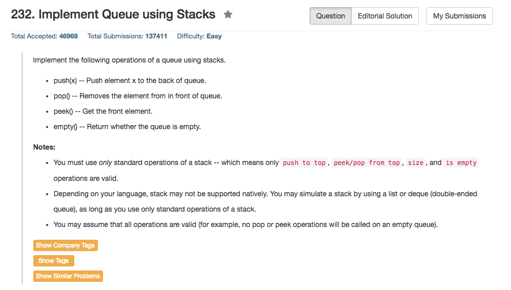

## Algorithm 

- 这个就是一个数据结构题目，其实还蛮好想的。
- 基本思路就是用两个栈来模拟一个队列，重要的问题是队列要求先进先出
    1. 一个pushStack来push数据到队列最后
    2. 一个popStack，倒过来，top表示队列最前面
    3. 基本操作就是Push就Push进入pushStack，因为反正是队列尾，慢慢放就好了
    4. 但是Pop操作和Peek操作有点麻烦，如果popStack是空的，这个比较好办，就把pushStack一个一个栈顶吐出来，然后放到popStack，经过一轮整理，整个popStack就的顺序就正了，栈顶是队列头，然后就一个一个出栈就好了。当然，如果当前popStack有数据，那么就先把popStack的数据都清理完，再把pushStack里面的所有数据放入popStack中

## Comment

- 既然使用栈模拟队列，C++就最好直接用stack这个高级的数据结构，一方面熟悉C++的STL，一方面也可以精炼代码。
- 注意在以上的思路中，pop和peak其实有同样的一步操作：就是把pushStack里面的东西吐出来放到popStack中。也就是说，pop()这个操作其实是要调用peak()这个操作的。根据 **Do Not Repeat Yourself** 的原则，在设计代码的时候必须考虑不要写重复的代码！
- 可以用递归的方法，通过用系统栈和一个数据结构栈来实现，但是我觉得时间复杂度并不是很好的。具体的代码可以看[这里](https://leetcode.com/discuss/46795/0-ms-c-solution-using-one-stack-w-explanation)，也算是一个有意思的解法。

## Code

```c++
class Queue {
    stack<int> pushStack, popStack;
    
public:
    // Push element x to the back of queue.
    void push(int x) {
         pushStack.push(x);
    }

    // Removes the element from in front of queue.
    void pop(void) {
        peek(); //Do not repeat yourself
        popStack.pop();
    }

    // Get the front element.
    int peek(void) {
        if (popStack.empty()){
            while (!pushStack.empty()){
                popStack.push(pushStack.top());
                pushStack.pop();
            }
        }
        return popStack.top();
    }

    // Return whether the queue is empty.
    bool empty(void) {
        return (popStack.empty() && pushStack.empty());
    }
};
```