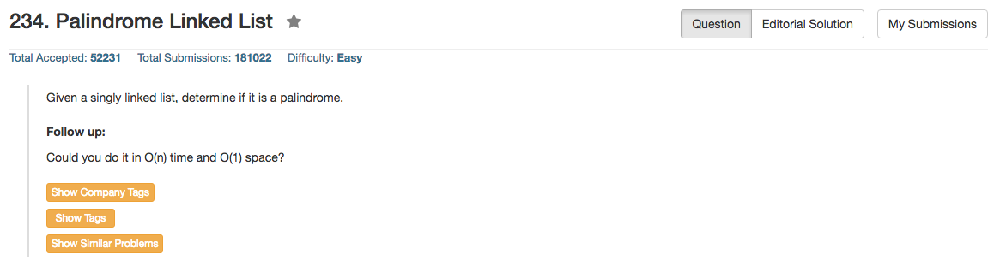

## Algorithm 

- 这个题目太bug了，我想了好久想到了直接reverse一半左右的链表，但是这样怎么想都很作弊啊，还可以直接改变链表结构的啊。
- [这里这个帖子](https://leetcode.com/discuss/45309/reversing-a-list-is-not-considered-o-1-space)关于空间复杂度的讨论还蛮有意思的。贴主的主要观点是认为改写了链表，所以空间复杂度不能认为是O(1)，而反对者的论点是这里所谓的空间复杂度是『额外使用的空间』，而改写链表结构并没有额外使用内存空间，所以不能算到空间复杂度中。
- [这个帖子](https://leetcode.com/discuss/65043/my-easy-understand-c-solution)用了递归的方法写了一个很有意思，也很优美的算法，虽然空间复杂度是O(N)的，其程序贴在下面了。

## Comment

- 需要问面试官能不能改变链表结构，这个要素直接决定了算法。

## Code

用Reverse链表的方法，程序来自[这里](https://leetcode.com/discuss/44775/share-my-c-solution-o-n-time-and-o-1-memory)，我的程序怎么写都通过不了，总是TLE，我也是很奇怪的，非常奇怪。所以这道题目还要仔细研究一下。

```C++
class Solution {
public:
    bool isPalindrome(ListNode* head) {
        if(head==NULL||head->next==NULL)
            return true;
        ListNode* slow=head;
        ListNode* fast=head;
        while(fast->next!=NULL&&fast->next->next!=NULL){
            slow=slow->next;
            fast=fast->next->next;
        }
        slow->next=reverseList(slow->next);
        slow=slow->next;
        while(slow!=NULL){
            if(head->val!=slow->val)
                return false;
            head=head->next;
            slow=slow->next;
        }
        return true;
    }
    ListNode* reverseList(ListNode* head) {
        ListNode* pre=NULL;
        ListNode* next=NULL;
        while(head!=NULL){
            next=head->next;
            head->next=pre;
            pre=head;
            head=next;
        }
        return pre;
    }
};
```


递归版本，写的很优美，利用了全局变量，局部变量和递归的特性。

```c++
class Solution {
public:
    ListNode* temp;
    bool isPalindrome(ListNode* head) {
        temp = head;
        return check(head);
    }

    bool check(ListNode* p) {
        if (NULL == p) return true;
        bool isPal = check(p->next) & (temp->val == p->val);
        temp = temp->next;
        return isPal;
    }
};
```