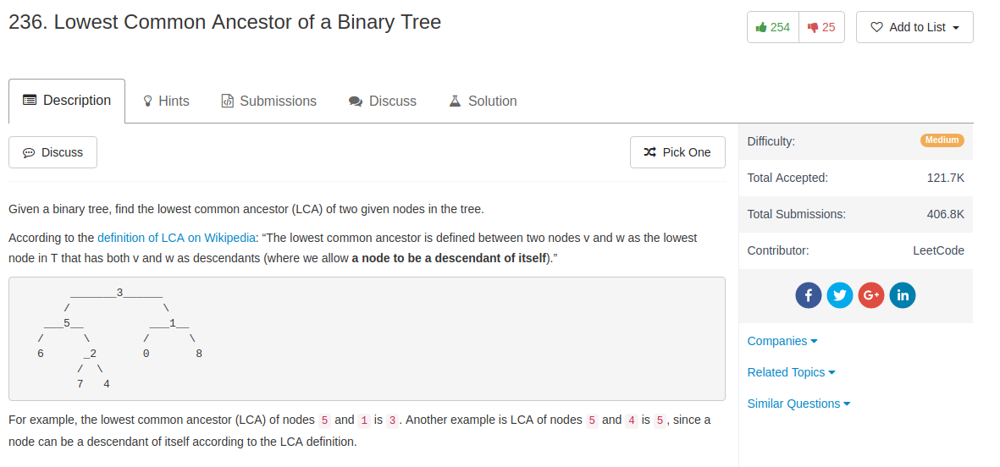

## Algorithm

- 其实很简单，如果`p`和`q`都在`root`的左子树，那么结果肯定也在`root`的左子树；如果两个都在`root`右子树，那结果也在右子树；如果一个在左边，一个在右边，那么`root`就是当前的LCA

## Comment

- 大坑，这里的`p`和`q`是具体的节点，所以在比较的时候要用`root == p`和`root == q`，而不能只是比较`val`

## Code

StefanPochmann的简短解法

```python
def lowestCommonAncestor(self, root, p, q):
    if root in (None, p, q): return root #这个真是很厉害
    left, right = (self.lowestCommonAncestor(kid, p, q)
                   for kid in (root.left, root.right))
    return root if left and right else left or right
```


我的解法，明显还是写复杂了

```python
# Definition for a binary tree node.
# class TreeNode(object):
#     def __init__(self, x):
#         self.val = x
#         self.left = None
#         self.right = None

class Solution(object):
    def post_order(self, root, p, q):
        if root is None:
            return None, []
        l_ans, l_find = self.post_order(root.left, p, q)
        r_ans, r_find = self.post_order(root.right, p, q)
        find = l_find + r_find
        ans = l_ans or r_ans
        if ans is not None:
            return ans, find
        else:
            if root == p:
                find.append(p)
            elif root == q:
                find.append(q)
            if len(find) == 2:
                ans = root
            print root.val, ans, find
            return ans, find

    def lowestCommonAncestor(self, root, p, q):
        """
        :type root: TreeNode
        :type p: TreeNode
        :type q: TreeNode
        :rtype: TreeNode
        """
        ans, _ = self.post_order(root, p, q)
        return ans

```
