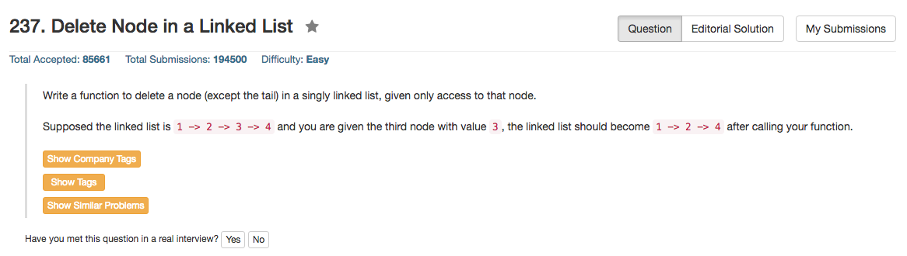

## Algorithm 

- 题目令人困扰
- 看完解释以后发现这个题目还是非常有道理的：因为我们没有当前结点的前一个结点的信息，所以如果贸然删除当前结点的话，整个链表会崩溃。于是现在的解法就是：把下一个结点的所有信息copy到当前结点来，然后再删除下一个结点的信息。
- 因为题目说了不会是要删除最后一个结点，所以边界条件的判断也就省了。
- _这个题目意外地很tricky，比较不错，我一开始被迷惑了。_

## Comment

- 这个题目完全不明白题目的意义在哪里。

## Code

```c
/**
 * Definition for singly-linked list.
 * struct ListNode {
 *     int val;
 *     struct ListNode *next;
 * };
 */
void deleteNode(struct ListNode* node) {
    struct ListNode * tmp = node->next;
    *node = *node->next; //如果不需要释放空间的话，这一句就够了。
    free(tmp);
}
```
<hr>

```python
def deleteNode(self, node):
    node.val = node.next.val
    node.next = node.next.next
```
