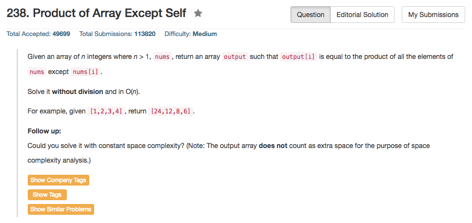

## Algorithm 

- 这个题目最直接的想法是全部累乘起来然后一个个除，当然这样的结果是overflow，肯定是不行的
- 于是题目的第一个要求是不能用乘法，这倒是好解决：用两个数组来分别记录: 
    1. `Forward[i] = nums[0] * nums[1] * ... * nums[i-1]`
    2. `Backward[i] = nums[i+1] * nums[i+2] * ... * nums[n-1]`
    3. `ans[i] = Forward[i] * Backward[i]`
- 然后题目有另外一个要求是只能用O(1)的额外空间，这就有点难了。但是仔细看一下会发现，其实题目是允许你开一个O(N)的output数组的，也就是说不是要求你在nums上面直接操作，而是你可以新开一个数组进行操作。那这样就很简单了，因为要做的就是把上面那个Forward和Backward数组变成两个指针来储存结果就好了，而我们可以看到本来这两个数组就不需要记录`i-1`之前的数据。

## Comment

- 一个递推的题目

## Code

额外用了O(N)的空间

```c++
class Solution {
public:
    vector<int> productExceptSelf(vector<int>& nums) {
        int forward[nums.size()] = {}, backward[nums.size()] = {}, n = nums.size();
        forward[0] = 1;
        backward[n - 1] = 1;
        for (int i = 1; i < n; i++) 
            forward[i] = forward[i - 1] * nums[i - 1];
        for (int i = n - 2; i >= 0; i--)
            backward[i] = backward[i + 1] * nums[i + 1];
        for (int i = 0; i < n; i++)
            nums[i] = forward[i] * backward[i];
        return nums;
    }
};
```

额外用O(1)的空间

```c++
class Solution {
public:
    vector<int> productExceptSelf(vector<int>& nums) {
        vector<int> ans(nums.size());
        int forward = 1, backward = 1, n = nums.size();
        for (int i = 0; i < n; i++) ans[i] = 1;
        for (int i = 0; i < n; i++){
            ans[i] = ans[i] * forward;
            ans[n - i - 1] = ans[n - i - 1] * backward;
            forward = forward * nums[i];
            backward = backward * nums[n - i - 1];
        }
        return ans;
    }
};
```