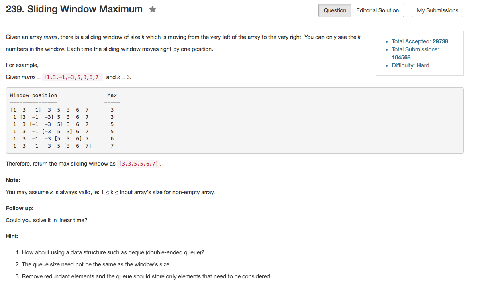

## Algorithm 

- 这个题目其实主要是维护这样一个队列：
    1. 队首是当前的最大值
    2. 如果当前队首超过了范围，队首出队。这个时候我们期待的是剩下的队首是所有剩下的元素里面的最大值
    3. 为了达到2，我们在每加入一个元素的时候，如果`nums[i]`大于当前队尾，那么由于新的元素位置更新，所以当前队尾永远不可能是候选最大值，该队尾元素出队。
    4. 第3步一直做到队列没有元素（此时新的元素是最大值），或者队列里面元素严格递减（这样每次队首出队之后，剩下的队首就会是合法范围内的最大值）。
    5. 为了维护这样一个队列，我们需要double-ended queue，也就是deque。这个数据结构在C++的STL中有，需要学习。

## Comment

- deque这样一个数据结构值得多了解一下，毕竟属于C++的STL

## Code

```C++
class Solution {
public:
    vector<int> maxSlidingWindow(vector<int>& nums, int k) {
        deque<int> maxSet(k), position(k);
        vector<int> ans;
        if (nums.size() == 0 || k == 0) return ans;
        for (int i = 0; i < nums.size(); i++){
            if (position.size() && position.front() + k <= i) {
                maxSet.pop_front();
                position.pop_front();
            }
            while (maxSet.size() && nums[i] > maxSet.back()){
                maxSet.pop_back();
                position.pop_back();
            }
            maxSet.push_back(nums[i]);
            position.push_back(i);
            if (maxSet.size() && i >= k - 1) ans.push_back(maxSet.front());
        }
        return ans;
    }
};
```

[这里](https://discuss.leetcode.com/topic/19067/clean-c-o-n-solution-using-a-deque)有更加简洁的版本，实际上的确是只要记录最大值的位置就可以了，不需要记录最大值是多少。

```C++
class Solution {
public:
    vector<int> maxSlidingWindow(vector<int>& nums, int k) {
        deque<int> dq;
        vector<int> ans;
        for (int i=0; i<nums.size(); i++) {
            if (!dq.empty() && dq.front() == i-k) dq.pop_front();
            while (!dq.empty() && nums[dq.back()] < nums[i])
                dq.pop_back();
            dq.push_back(i);
            if (i>=k-1) ans.push_back(nums[dq.front()]);
        }
        return ans;
    }
};
```