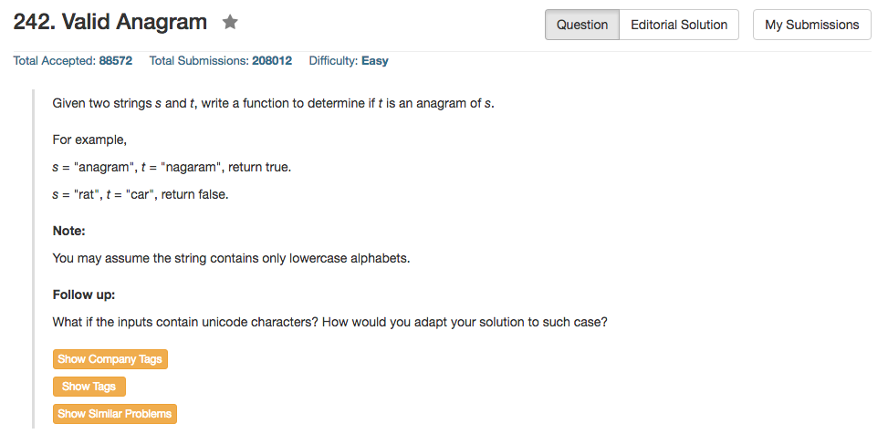

## Algorithm 

- 这个题目还真的是没什么好说的，因为很明显s和t要是anagram只有一个条件：就是他们出现的字符和字符出现的个数一样。
- 根据这个条件，只要统计s里面出现了哪些字符，然后看t里面是不是出现了同样的字符，以及字符是不是出现了同样的次数，就可以了。
- 可以理解为用Hash表吧，虽然题目只有26个小写字符。再多一点其实也无所谓了，不过到了UNICODE的范围可能就不能直接开一个数组记录出现的次数了。

## Comment

- 老实说现在的程序存在多余的运算过程，但是要是把琐碎的冗余运算都判断掉，整个程序就不优美了。现在的版本可能是我能写出来的最简洁的代码版本吧。

## Code

```c++
class Solution {
public:
    bool isAnagram(string s, string t) {
        int count[26] = {0};
        for (int i = 0; i < s.size(); i++) count[s[i] - 'a']++;
        for (int i = 0; i < t.size(); i++) count[t[i] - 'a']--;
        for (int i = 0; i < 26; i++)
            if (count[i]) return false;
        return true;
    }
};
```