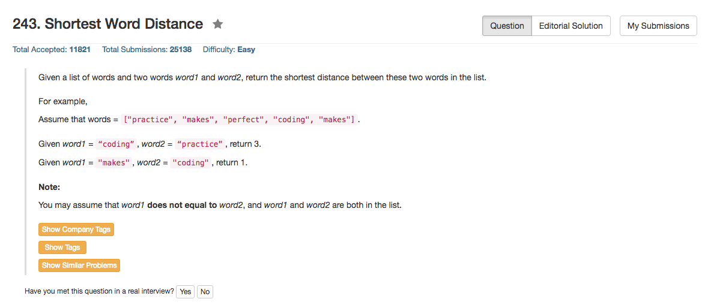

## Algorithm 

- 完全没有想到有O(N^2)的算法，因为O(N)的算法很直观很好想。
- 基本思路就是遍历一遍数组，并且记录最近遇到的word1或者word2的位置，每次更新那个单词的位置，再算一遍已经找到的两个单词的位置之间的距离dist，如果新的dist小于已知的dist，就更新已知的dist。

## Comment

- 这个题目主要是看代码怎么写的好看，下面Python提供了一个写的很简洁的代码，虽然时间和空间上都比较浪费。
- Python倒是一次就写对了，为了纠结C的pointer to pointer结果写了好久，没想到C那个程序纠缠了太长时间。

## Code

```C
int shortestDistance(char** words, int wordsSize, char* word1, char* word2) {
    int first = -1, second = -1, dist = wordsSize, count = 0;
    for (count = 0; count < wordsSize;count++){
        if (strcmp(words[count], word1) == 0) first = count;
        if (strcmp(words[count], word2) == 0) second = count;
        dist = (first >= 0 && second >= 0 && abs(first - second) < dist) ? abs(first - second) : dist;
    }
    return dist;
}
```
<hr>

```Python
class Solution(object):
    def shortestDistance(self, words, word1, word2):
        """
        :type words: List[str]
        :type word1: str
        :type word2: str
        :rtype: int
        """
        first = second = dist = - 1;
        for ind, word in enumerate(words):
            if word == word1:
                first = ind;
            if word == word2:
                second = ind;
            if first >=  and second >= 0 and (dist < 0 or dist > abs(first - second)):
                dist = abs(first - second);
        return dist
```

在[这里](https://leetcode.com/discuss/78196/python-3-lines-solution)的讨论中，作者给出了以下这个有趣的程序。思路其实蛮清楚的，但是时间上就慢了很多了，最坏的情况下实际上是个O(N^2)的。

```Python
class Solution(object):
    def shortestDistance(self, words, word1, word2):

        w1 = [i for i in xrange(len(words)) if words[i] == word1]
        w2 = [i for i in xrange(len(words)) if words[i] == word2]

        return min([abs(i - j) for i in w1 for j in w2])
```