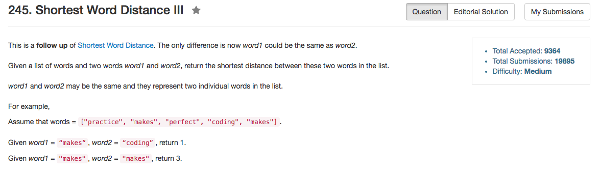

## Algorithm 

- 这个问题本质上就是two pointer，跟它的简化版本没什么区别。
- 基本的想法就是: 如果`words[i] == word1`，那么就更新word1的坐标；如果`words[i] == word2`，就更新word2的坐标；然后每次就看最新的坐标差之间是不是更小
- 现在这道题目有一个问题，就是`word1 == word2`是有可能的，方法也很容易，就是添加一个条件：如果`word1 == word2`的时候
    1. 如果`words[i] == word1`，那么就把word1的坐标给word2，然后word1更新为当前的坐标
    2. 如果`words[i] == word2`，因为这时候两个备选相同，所以不更新word2的坐标。

## Comment

- C++的std::string类型可以直接`word1 == word2`，而C的字符串类型只能用`strcmp(s1, s2)`，这两个要注意差别。

## Code


```C++
class Solution {
public:
    int shortestWordDistance(vector<string>& words, string word1, string word2) {
        bool isEqual = (word1 == word2);
        int n = words.size(), pos1 = -1, pos2 = -1, min = INT_MAX;
        for (int  i = 0; i != n; i++){
            if (words[i] == word1){
                if (isEqual){
                    pos2 = pos1;
                }
                pos1 = i;
            } 
            if ((words[i] == word2) && !isEqual){
                pos2 = i;
            }
            if ((pos1 != -1) && (pos2 != -1) && (abs(pos1 - pos2)) < min){
                min = abs(pos1 - pos2);
            }
        }
        return min;
    }
};
```
