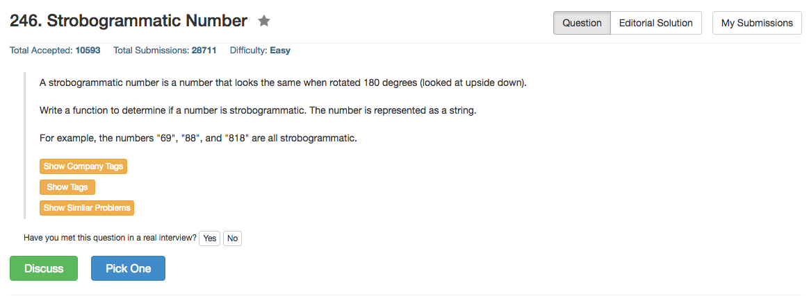

## Algorithm 

- 这种题目就是考细心的。
- 我一开始没有把所有的符合条件的数字找到，简直就是耻辱。

## Comment


- C++找`string num`的长度: `num.size()`或者`num.length()`
- C找`char * num`的长度: `strlen(num)`

## Code

```c++
class Solution {
public:
    bool isStrobogrammatic(string num) {
        for (int i = 0, j = num.size() - 1; i <= j; i++, j--){
            if ( !((num[i] == '0' && num[j] == '0') ||
                   (num[i] == '1' && num[j] == '1') ||
                   (num[i] == '8' && num[j] == '8') ||
                   (num[i] == '6' && num[j] == '9') ||
                   (num[i] == '9' && num[j] == '6')))
                    return false;
        }
        return true;
    }
};
```

[这里](https://leetcode.com/discuss/50523/0ms-c-solution)讨论了用`map<char, char>`的做法，是C++的语法，需要学习。