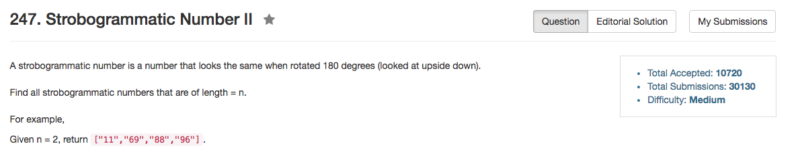

## Algorithm 

- 这道题目没什么，就是递归直接写。
- 需要考虑的边界条件主要是什么时候可以用0，什么时候不能用0，以及什么时候要放两个，什么时候只能放一个。

## Comment

- string的初始化好麻烦啊，我还是不知道什么时候可以用`string a("100")`，什么时候只能用`string a = string("100")`

## Code

```C++
class Solution {
public:
    vector<string> findStrobogrammatic(int n) {
        string tmpResult = string(n, ' ');
        visit(tmpResult, 0, n - 1);
        return result;
    }
private:
    vector<string> result;
    string one = string("018"), twoL = string("01689"), twoR = string("01986");
   
    void visit(string& tmpResult, int left, int right){
        if (left > right){
            result.push_back(tmpResult);
        } else if (left == right){
            for (int i = 0; i < one.length(); i++){
                tmpResult[left] = one[i];
                result.push_back(tmpResult);
            }
        } else {
            for (int i = 0 + (left == 0); i < twoL.length(); i++){
                tmpResult[left] = twoL[i];
                tmpResult[right] = twoR[i];
                visit(tmpResult, left + 1, right - 1);
            }
        }
    }
};
```
