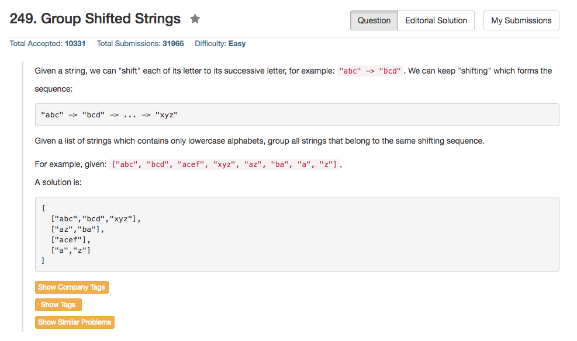

## Algorithm 

- 这个题目也不难，但是用我在语言实现上花了点时间
- 基本的思路可以用Hash表实现，把每一个字符串都转化为『标准字符串』，所谓的标准字符串就把这个字符串的第一个字符变成一个固定的字符，比如'a'，然后看对应整个字符串变成了什么样子。比如'bcd' -> 'abc'; 'xyz' -> 'abc'。
- 标准化了每一个字符串了以后就很简单了，看Hash表里面有没有已经存在了这个标准化的字符串，有的话那就找到了它的组；没有的话，那就新开一个组。

## Comment

- C++里面的`vector<vector<string>>`这个结构不是很好处理，当然C里面的`char ***`更加不好处理。
- 这里C++的解法主要是在vector的添加上花了时间，说白了就是不知道怎么顺利地将一个新的值放到答案数据结构中。搞了好久才使用了一个临时的`vector<string>`来储存新的组，然后`push`到结果的数据结构中。
- 以上的C++的麻烦的地方，倒是让我想到了R和Matlab在数据操作上的优点。

## Code

```c++
class Solution {
public:
    vector<vector<string>> groupStrings(vector<string>& strings) {
        const int charSetSize = 26;
        int groupCount = 0;
        std:unordered_map<string, int> hashSet;
        vector<vector<string>> answer;
        for (int i = 0; i < strings.size(); i++){
            string tmp = strings[i];
            int shift = tmp[0] - 'a';
            for (int scan = 0; scan < tmp.size(); scan++){
                tmp[scan] = 'a' + ((tmp[scan] - 'a' - shift  + charSetSize) % charSetSize);
            }
            if (hashSet.find(tmp) != hashSet.end()){
                answer[hashSet[tmp]].push_back(strings[i]);
            } else {
                vector<string> newGroup;
                newGroup.push_back(strings[i]);
                answer.push_back(newGroup);
                hashSet[tmp] = groupCount++;
            }
        }
        return answer;
    }
};
```