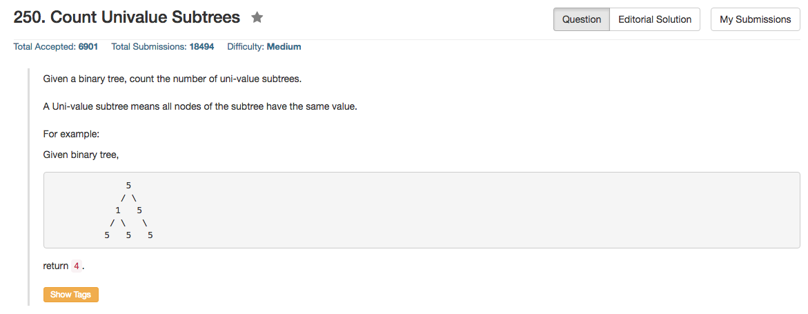

## Algorithm 

- 这道题目倒是不难，但是写的时候还是在边界条件想了一下。
- 基本的思路就是： 
    1. 左子树是不是uni-tree
    2. 右子树是不是uni-tree
    3. `root->val`跟左右子树的值是不是一样。
    4. 如果1-3都是true，那么root为根的子树也是uni-tree，那么答案总数增加1.
    5. 当然，由于我考虑的是`root为根的子树的uni-tree的个数=左子树uni-tree个数+右子树uni-tree个数+本身是否是uni-tree`

## Comment

- 二叉树嘛，没什么特别的，就是在遍历的时候顺便记录一些其他的信息就好了。

## Code


```c++
class Solution {
public:
    int count(TreeNode* root, bool& uni){
        if (root == NULL){
            uni = true;
            return 0;
        } else {
            bool left_uni, right_uni;
            int left_count = count(root->left, left_uni);
            int right_count = count(root->right, right_uni);
            uni = left_uni && right_uni;
            if (root->left != NULL) uni = uni && (root->val == root->left->val);
            if (root->right != NULL) uni = uni && (root->val == root->right->val);
            return left_count + right_count + (uni == true);
        }       
    }
    int countUnivalSubtrees(TreeNode* root) {
        bool uni;
        return count(root, uni);
    }
};
```