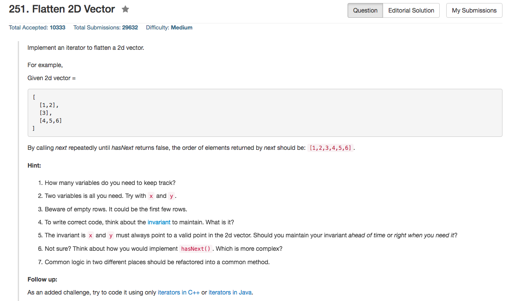

## Algorithm 

- 这道题目我觉得主要在于学习C++这门语言的STL的iterator。
- 当然，我是没有做出来，因为我并不知道iterator应该怎么用，最好的答案来自于[这里](https://leetcode.com/discuss/50292/7-9-lines-added-java-and-c-o-1-space)


## Comment

- 感觉iterator本质上就是指针啊
- 注意符号优先级的使用，比如`*it.size()`就是不对的，因为是`(*it).size`，因为`*`优先级很低，所以一开始那句话相当于是`*(it.size())`，而`it`本身是一个指针，是没有`.size()`这个函数的

## Code

这个答案是从上面提到的部分抄下来的。边界条件控制的更好。

```c++
class Vector2D {
    vector<vector<int>>::iterator i, iEnd;
    int j = 0;
public:
    Vector2D(vector<vector<int>>& vec2d) {
        i = vec2d.begin();
        iEnd = vec2d.end();
    }

    int next() {
        hasNext();
        return (*i)[j++];
    }

    bool hasNext() {
        while (i != iEnd && j == (*i).size())
            i++, j = 0;
        return i != iEnd;
    }
};
```

以下这个代码是我根据上面的结果改编的，全都是用的iterator

```c++
class Vector2D {
public:

    Vector2D(vector<vector<int>>& vec2d) {
        allIt = vec2d.begin();
        endIt = vec2d.end();
        if (allIt!=endIt) branchIt = (*allIt).begin();
    }

    int next() {
        return *branchIt++;
    }

    bool hasNext() {
        while (allIt != endIt && branchIt == (*allIt).end()){
                allIt++;
                branchIt = (*allIt).begin();
        }
        return (allIt != endIt);
    }
private:
    std::vector<vector<int>>::iterator allIt, endIt;
    std::vector<int>::iterator branchIt;
};
```