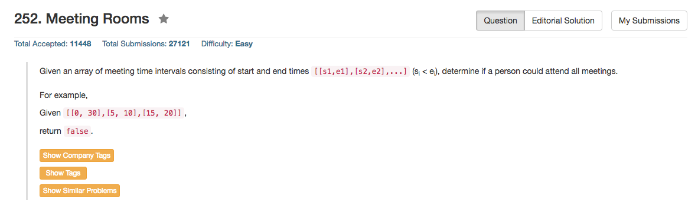

## Algorithm 

- 这道题目也是比较容易想的，因为就是排序，然后看先后两个interval有没有重合。这个可以看做是一种贪心算法吧。
- 这个题目其实最麻烦的是使用c++的sort函数，因为要自己定义comparsion，我除了好多问题，主要是不知道sort函数到底要带入哪些参数。

## Comment

- C++的sort函数要学习一下。

## Code

```c++
/**
 * Definition for an interval.
 * struct Interval {
 *     int start;
 *     int end;
 *     Interval() : start(0), end(0) {}
 *     Interval(int s, int e) : start(s), end(e) {}
 * };
 */
class Solution {
public:
    static bool comparison(const Interval & i, const Interval & j){
        return (i.start < j.start || (i.start == j.start && i.end <= j.end));
    }
    bool canAttendMeetings(vector<Interval>& intervals) {
        sort(intervals.begin(), intervals.end(), comparison);
        for (int i = 1; i < intervals.size(); i++){
            if (intervals[i].start < intervals[i - 1].end)
                return false;
        }
        return true;
    }

};
```