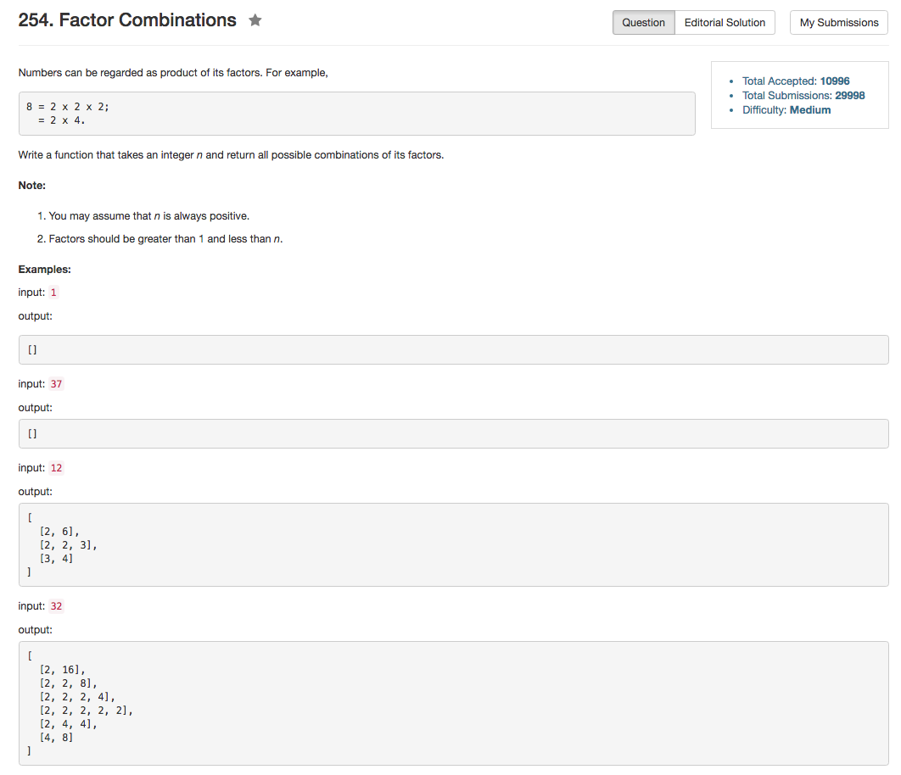

## Algorithm 

- 这道题目本质上就是一道背包问题，只是穿上了"factor decomposition"的外衣。
- 首先把`n`的所有除了1和n以外的因数都找出来，这个过程跟分解质因数的过程相似。
- 然后，对于每一个因数，就是看放几个放到结果里面。
- 这里主要是要注意的是，因为某一个因数可以放k个，所以在回溯的时候要注意，一次性回溯清空所有当前因数在结果数组中的存在。

## Comment

- 一开始回溯的代码写错了。

## Code

```C++
class Solution {
public:
    vector<vector<int>> getFactors(int n) {
        vector<int> tmpResult, factors;
        for (int i = 2; i <= n / i; i++){
            if (n % i == 0) {
                factors.push_back(i);
                if (i != n / i) {
                    factors.push_back(n / i);
                }
            }
        }
        if (factors.size() != 0){
            sort(factors.begin(), factors.end());
            goFactors(0, n, factors, tmpResult);
        }
        return result;
    }
private:
    vector<vector<int>> result;
    void goFactors(int pos, int n, vector<int>& factors, vector<int> & tmpResult){
        if (n == 1){ 
            result.push_back(tmpResult);
            return;
        } 
        if (pos >= factors.size()){
            return;
        }
        goFactors(pos + 1, n, factors, tmpResult);
        int origin = n;
        while (factors[pos] <= n && n % factors[pos] == 0){
            n /= factors[pos];
            tmpResult.push_back(factors[pos]);
            goFactors(pos + 1, n, factors, tmpResult);
        }
        while (n < origin){
            tmpResult.pop_back();
            n *= factors[pos];
        }
    }
};
```
