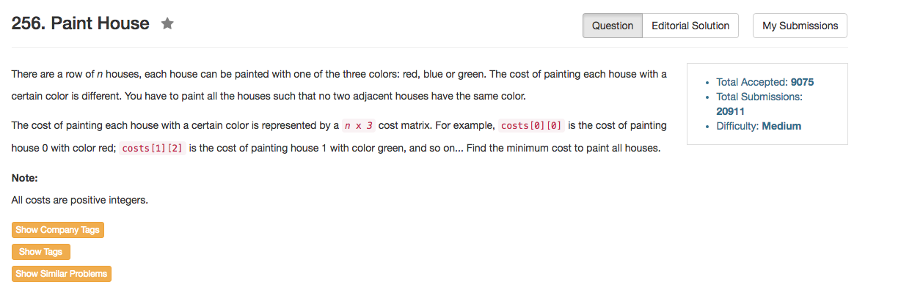

## Algorithm 

- 这个题目也就是DP，思路很简单
    1. 设`F[i][k]`表示截止到第`i`个房子涂上第`k`个颜色所能得到的最小值。
    2. `F[i][0] = min(F[i-1][1], F[i-1][2]) + costs[i][0]`
    3. `F[i][1] = min(F[i-1][0], F[i-1][2]) + costs[i][1]`
    4. `F[i][2] = min(F[i-1][0], F[i-1][1]) + costs[i][2]`
    5. 由于第`i`个状态只跟`i - 1`有关，直接用滚动数组记录一下就好了。

## Comment

- 竟然又是出现了数组访问以`1`为下标开头的错误！！
- 数组初值：`int ans[2][3] = {{costs[0][0], costs[0][1], costs[0][2]}, {0, 0, 0}};`

## Code

```C++
class Solution {
public:
    int minCost(vector<vector<int>>& costs) {
        if (costs.size() == 0) return 0;
    
        int ans[2][3] = {{costs[0][0], costs[0][1], costs[0][2]}, {0, 0, 0}}, oldp = 0, newp = 1, n = costs.size();
        for (int i = 1; i < n; i++){
            ans[newp][0] = min(ans[oldp][1], ans[oldp][2]) + costs[i][0];
            ans[newp][1] = min(ans[oldp][0], ans[oldp][2]) + costs[i][1];
            ans[newp][2] = min(ans[oldp][0], ans[oldp][1]) + costs[i][2];
            oldp = 1 - oldp;
            newp = 1 - newp;
        }
        return min(min(ans[oldp][0], ans[oldp][1]), ans[oldp][2]);
    }
};
```

