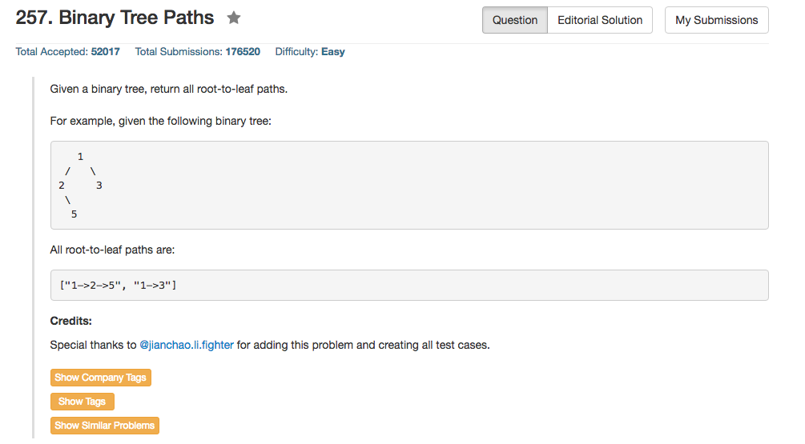

## Algorithm 

- 这道题目也没有什么特别的，就是二叉树遍历一遍，到了叶子节点的时候输出path就好了。
- 我这里使用了全局变量来记录当前的path，当然也可以把path作为函数参数带入更新
- 重要的一个问题是，如果只有一个元素，path是没有"->"这个部分的。

## Comment

- 还是要注意细节和边界条件！

## Code

```c++
class Solution {
public:
    vector<string> ans;
    string path;
    vector<string> binaryTreePaths(TreeNode* root) {
        if (root) go(root);
        return ans;
    }
    
    void go(TreeNode * root){
        int originalLength = path.size();
        if (originalLength == 0){
            path = path + to_string(root->val);
        } else {
            path = path + "->" + to_string(root->val);
        }
        if (root->left == NULL && root->right == NULL) {
            ans.push_back(path);
        } else {
            if (root->left) go(root->left);
            if (root->right) go(root->right);
        }
        path = path.substr(0, originalLength);
    }
};
```
