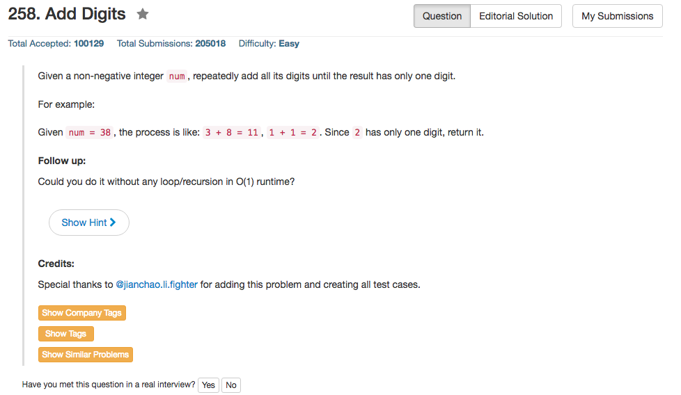

## Algorithm 

- Naive的解法实在是太直接了，所以没什么好说的。
- 既然题目要求O(1)的方法，基本上可以确定是找规律，然后可以从0开始，发现规律如下，非常简单。

<pre>
NUM: 0 
ANS: 0

NUM: 1  2  3  4  5  6  7  8  9
ANS: 1  2  3  4  5  6  7  8  9

NUM: 10 11 12 13 14 15 16 17 18 
ANS: 1  2  3  4  5  6  7  8  9

NUM: 19 20 21 22 23 24 25 26 27
ANS: 1  2  3  4  5  6  7  8  9
</pre>

## Comment

- 这个题目基本上就是找规律。
- Python的一行if-else的语法值得注意一下:

```Python
    true_value if expression else false_value
```


## Code

```C++
class Solution {
public:
    int addDigits(int num) {
        return num == 0? 0 : (num - 1) % 9 + 1; 
    }
};
```

<hr>

```python
class Solution(object):
    def addDigits(self, num):
        """
        :type num: int
        :rtype: int
        """
        return 0 if num == 0 else (num - 1) % 9 + 1;
```
<hr>
