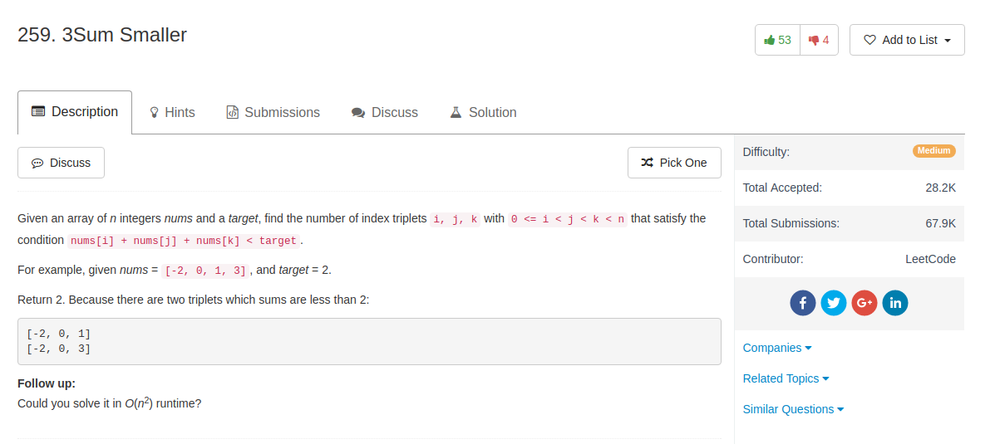

## Algorithm

- 很重要的一点是：这个题目实际上就是只要找出三个小标不一样的数，使得他们的和小于target，具体的下标其实并不重要，因为反正一个tuple里面可以重新定义`i,j,k`
- $O(n^3)$的方法就是直接枚举`i,j,k`
- $O(n^2\log(n))$的方法就是先sort整个数组，这样的话，枚举`i, j`，然后根据不等式得到`upper bound = target - i - j`，然后可以二分查找这个upper bound在哪里，然后所有小于upper bound的且不是`i,j`的都可以作为`k`的选择，这样直接算就可以了
- $O(n^2)$的方法：
  - 首先还是sort整个数组
  - 然后枚举`i`，时间是$O(n)$
  - 然后假设`j = i + 1`，这个时候可以找到最大的`k`使得`nums[i] + nums[j] + nums[k] < target`，而且`k-j`这么多个数都可以作为`k`的选择
  - 这个时候，我们只需要移动`j`，当`j`增大的时候，这个最大的`k`的下标只能维持不动，或者减小，也就是说是单调非增的。所以`j`和`k`最终会在某个地方相遇，这个过程中，每一次更新`j`都可以算一次最大`k`与`j`之间的距离，从而计算出有多少组解在。
  - 整个扫`j`的时间是$O(n)$

## Comment

- 都已经提示了可不可以用$O(n^2)$，还是可以想出来的。

## Code

```python
class Solution(object):
    def threeSumSmaller(self, nums, target):
        """
        :type nums: List[int]
        :type target: int
        :rtype: int
        """
        nums = sorted(nums)
        n = len(nums)
        total = 0
        for i in range(n):
            k = i + 1
            j = k + 1
            while k < n and j < n and nums[i] + nums[k] + nums[j] < target:
                j = j + 1
            j = j - 1
            while k < n and j < n and k < j:
                while k < j and nums[i] + nums[k] + nums[j] >= target:
                    j = j - 1
                if k < j:
                    total += j - k
                k = k + 1
        return total
```
