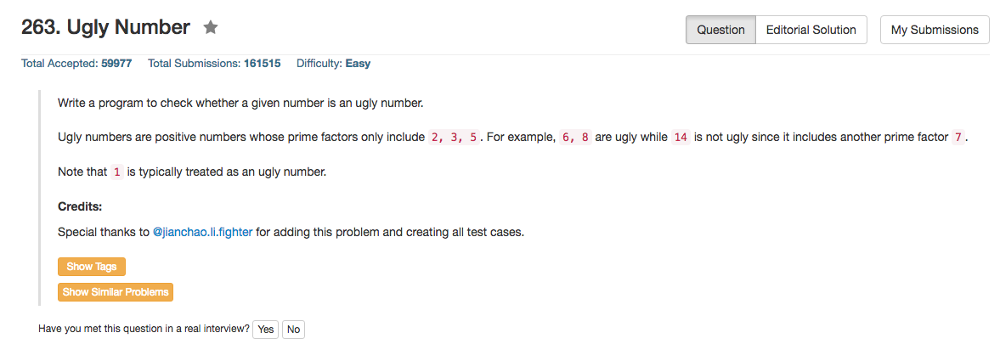

## Algorithm 

- 就是直接暴力做
- 但是这个题目需要考虑一些边界情况。 
    - 0 是不是 Ugly Number?
    - 负数 是不是 Ugly Number?


## Comment

- [这里](https://leetcode.com/discuss/97377/python-1-line-solution)讨论了Python的一行的写法，但是这个解法实际上在作弊，所以不能算是好的one line solution.
- 在代码里面，Python有一行特别Bug的写法：`while num % p == 0 < num:`，这个强制做了两个判断，把`num==0`的情况就融入到一起了，也是厉害。

## Code

```C
bool isUgly(int num) {
    for (int i = 2; i <= 5 && num; i++)
        while (num % i == 0) 
            num /= i;
    return num == 1;
}
```

<hr>
最终的精简版本来自[这个](https://leetcode.com/discuss/52703/2-4-lines-every-language)讨论，我自己写的Python的版本比较丑。

```python
class Solution(object):
    def isUgly(self, num):
        """
        :type num: int
        :rtype: bool
        """
        for p in 2,3,5:
            while num % p == 0 < num:
                num /= p;
        return True if num == 1 else False;
```
<hr>
