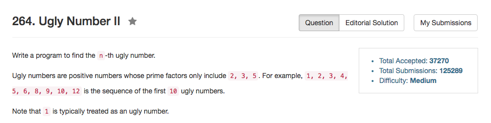

## Algorithm 

- 这题比较厉害，我是从[这里](https://discuss.leetcode.com/topic/21882/my-16ms-c-dp-solution-with-short-explanation)学到的解法。
- 就是用三个index表示当前最小的2的倍数、3的倍数、5的倍数，用原作的话来说就是：
	1. `k[1] = min( k[0]x2, k[0]x3, k[0]x5)`. The answer is k[0]x2. So we move 2's pointer to 1. 
	2. `k[2] = min( k[1]x2, k[0]x3, k[0]x5)`. And so on. Be careful about the cases such as 6, in which we need to forward both pointers of 2 and 3.
- 这个解法太棒了
- 我一开始想到的是维护一个minHeap，然后每次取最小的，然后把其`x * 2, x * 3, x * 5`丢进堆里。但是我的这个想法要比上面的想法差了很多。


## Comment

- 这个题目解法好，非常值得学习，感觉思路焕然一新。

## Code

我的程序，比较冗长，直接看下面的比较好。

```C++
class Solution {
public:
    int nthUglyNumber(int n) {
        vector<int> update(3, 0);
        vector<int> results(n, 1);
        int minIndex, newElement, i = 1;
        while (i < n ){
            if (results[update[0]] * 2 < results[update[1]] * 3) {
                minIndex = results[update[0]] * 2 < results[update[2]] * 5 ? 0 : 2;
            } else {
                minIndex = results[update[1]] * 3 < results[update[2]] * 5 ? 1 : 2;
            }
            switch (minIndex){
                case 0: newElement = results[update[0]++] * 2; break;
                case 1: newElement = results[update[1]++] * 3; break;
                case 2: newElement = results[update[2]++] * 5; break;
            }
            if (results[i - 1] != newElement){
                results[i++] = newElement;
            }
        }
        return results[n - 1];
    }
};
```

来自[这里](https://discuss.leetcode.com/topic/21882/my-16ms-c-dp-solution-with-short-explanation)的解法。这个程序比我写的好多了。

```C++
class Solution {
public:
    int nthUglyNumber(int n) {
        if(n <= 0) return false; // get rid of corner cases 
        if(n == 1) return true; // base case
        int t2 = 0, t3 = 0, t5 = 0; //pointers for 2, 3, 5
        vector<int> k(n);
        k[0] = 1;
        for(int i  = 1; i < n ; i ++)
        {
            k[i] = min(k[t2]*2,min(k[t3]*3,k[t5]*5));
            if(k[i] == k[t2]*2) t2++; 
            if(k[i] == k[t3]*3) t3++;
            if(k[i] == k[t5]*5) t5++;
        }
        return k[n-1];
    }
};
```
