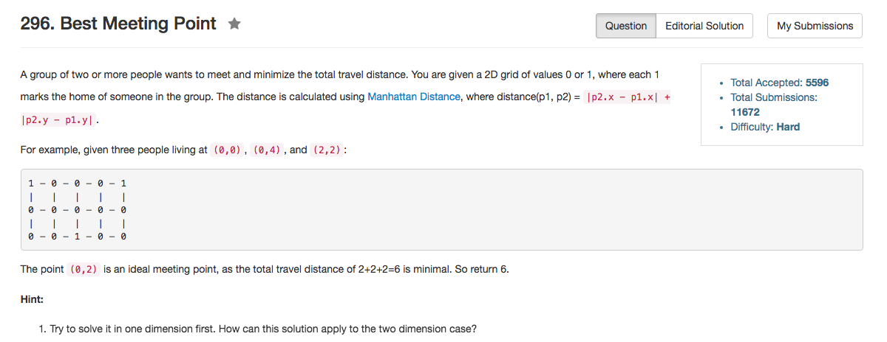

## Algorithm 

- 这个题目思路跟Paint House是一样的，DP的状态转移方程也是`F[i][j] = min(F[i - 1][j']) + costs[i][j]`
- 重要的问题是如何快速地找到这个`min(F[i - 1][j'])`。其实答案很简单：
    1. 如果`j_min`位置是`F[i - 1][j']`的最小值，那么所有非`j_min`位置的`F[i][j'] = min(F[i - 1][j']) + costs[i][j'] = F[i -1][j_min] + costs[i][j']`
    2. 同时`j_min`位置在第`i`个房子不能涂这个颜色，但是如果我们可以找到`j_min2`是`F[i-1][j']`的第二小的值，那么`F[i][j_min] = F[i - 1][j_min2] + costs[i][j_min]`
    3. 根据这个思路，我们只需要维护状态到达`i`号房子的最小值和次小值就可以了。这个可以O(k)的时间得到。
    4. 所以总时间复杂度是O(nk)的。

## Comment

- 我毕竟还是写得不够优美。

## Code

O(K)的辅助空间，没有用滚动数组。

```C++
class Solution {
public:
    int minCostII(vector<vector<int>>& costs) {
        if (costs.size() == 0) return 0;
        int n = costs.size(), k = costs[0].size();
        vector<int> ans(k);
        for (int colorId = 0; colorId < k; colorId++) 
            ans[colorId] = costs[0][colorId];
        for (int houseId = 1; houseId < n; houseId++){
            int min1 = INT_MAX, min2 = INT_MAX;
            for (int colorId = 0; colorId < k; colorId++){
                if (ans[colorId] <= min1){
                    min2 = min1;
                    min1 = ans[colorId];
                } else if (ans[colorId] <= min2){
                    min2 = ans[colorId];
                }
            }
            for (int colorId = 0; colorId < k; colorId++){
                ans[colorId] =  (ans[colorId] == min1) ? costs[houseId][colorId] + min2 : costs[houseId][colorId] + min1;
            }
        }
        int minAns = INT_MAX;
        for (int colorId = 0; colorId < k; colorId++) minAns = min(minAns, ans[colorId]);
        return minAns;
    }
};
```

以下使用滚动数组来实现的，稍微有一点点麻烦，但是更具有扩展性。思路跟前面的方法是一样的。

```C++
class Solution {
public:
    int minCostII(vector<vector<int>>& costs) {
        if (costs.size() == 0) return 0;
        int n = costs.size(), k = costs[0].size();
        vector<vector<int>> ans(2, vector<int>(k));
        for (int colorId = 0; colorId < k; colorId++) 
            ans[0][colorId] = costs[0][colorId];
        int oldp = 0, newp = 1;
        for (int houseId = 1; houseId < n; houseId++){
            int min1 = INT_MAX, min2 = INT_MAX;
            for (int colorId = 0; colorId < k; colorId++){
                if (ans[oldp][colorId] <= min1){
                    min2 = min1;
                    min1 = ans[oldp][colorId];
                } else if (ans[oldp][colorId] <= min2){
                    min2 = ans[oldp][colorId];
                }
            }
            for (int colorId = 0; colorId < k; colorId++){
                if (ans[oldp][colorId] == min1) {
                    ans[newp][colorId] = min2 + costs[houseId][colorId];
                } else {
                    ans[newp][colorId] = min1 + costs[houseId][colorId];
                }
            }
            oldp = 1 - oldp;
            newp = 1 - newp;
        }
        int minAns = INT_MAX;
        for (int colorId = 0; colorId < k; colorId++) minAns = min(minAns, ans[oldp][colorId]);
        return minAns;
    }
};
```