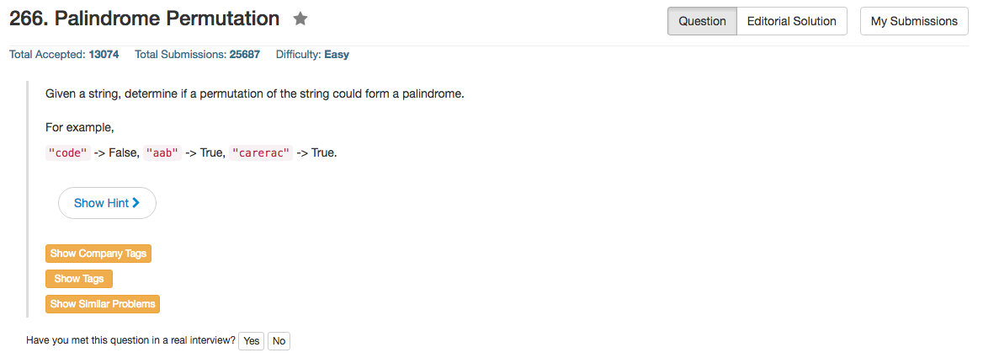

## Algorithm 

- 统计每个字符出现的次数，比如aab中，a出现2次，b出现1次。要成为回文数字，显然只有两种情况：
    1. 所有的字符都只出现过偶数次
    2. 仅有一个字符出现过奇数次。
- 扫一遍就可以统计完了。

## Comment

- 要注意这个题目并没有说明只有小写字符，完全有可能有各种各样诡异的字符出现，所以如果自己定义Hash Table的话，字符一共也就256中情况，如何允许的话，直接开一个长度为256的数组统计一下就好了。
- 如果一定很抠门，这个256的数组也可以用8个32位的长整形代替，然后用位操作，不过操作起来有点麻烦。
- Python的话，我用了set这个类型。`set()`和`set(char)`来进行每一次的操作，因为set类型有一个`setA ^ setB`的操作，这个操作仅保留setA和setB的不同处，相当于xor的作用，非常好地符合了当前的需求。

## Code

```c
bool canPermutePalindrome(char* s) {
    int count[256] = {}, scan, odd = 0;
    for (scan = 0; scan < strlen(s); scan++) count[s[scan]]++;
    for (scan = 0; scan < 256; scan++) odd += count[scan] % 2;
    return (odd <= 1);
}
```
<hr>

```python
class Solution(object):
    def canPermutePalindrome(self, s):
        """
        :type s: str
        :rtype: bool
        """
        odd = set();
        for char in s:
            odd = odd ^ set(char);
        return len(odd)<2
```

以及[这里](https://leetcode.com/discuss/53180/1-4-lines-python-ruby-c-c-java)提到的终极一行代码，也是绝了
```python
def canPermutePalindrome(self, s):
    return sum(v % 2 for v in collections.Counter(s).values()) < 2
```