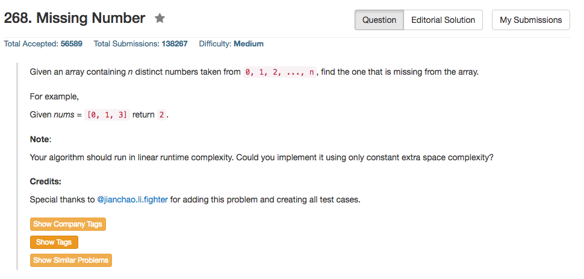

## Algorithm 

- 这个题目，看到之后的第一反应是：求和1到n然后依次减去不就好了？这的确是一种解法，但是这种解法存在一个潜在的危险——求和可能overflow
- 那么，不求和可以怎么做呢？用位操作咯！如果把0到 n都`xor`一次，然后再把数组里面的数字`xor`一次，那么只有一个数字会留下来，这个数字就是missing number。

## Comment

- 简单地说数学题，或者说是位操作。

## Code

用求和，存在栈溢出的危险。

```c++
class Solution {
public:
    int missingNumber(vector<int>& nums) {
        int n = nums.size();
        int sum = (1 + n) * n / 2;
        for (int i = 0; i < n; i++)
            sum = sum - nums[i];
        return sum;
    }
};
```

用位操作，不存在栈溢出的危险

```c++
class Solution {
public:
    int missingNumber(vector<int>& nums) {
        int n = nums.size();
        for (int i = 0; i < nums.size(); i++){
            n = n ^ i;
            n = n ^ nums[i];
        }
        return n;
    }
};
```