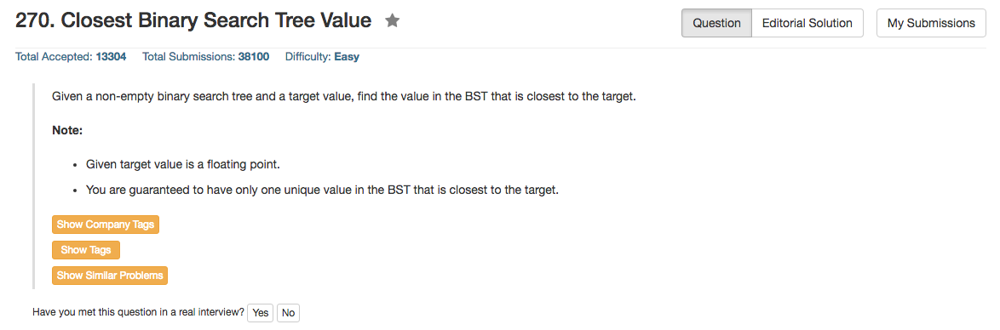

## Algorithm 

- 这个就是二叉排序树递归求解咯
- 其实只有两种情况，假设`target > root->val`
    1. `root->val`是离target最近的整数
    2. `root->val`的右子树的最左边那个数是离target最近的整数

## Comment

- C++有两个版本，一个是不是很安全的版本，但是代码更短——这个版本假设所有的整数都小于某一个上界(1<<31)
- C++的第二个版本更加安全，主要就是要判断边界条件，而不能把边界条件整合到一般的判断中
- 另外，`<<`的运算等级很低，记得用括号

## Code

不安全的版本

```c++
/**
 * Definition for a binary tree node.
 * struct TreeNode {
 *     int val;
 *     TreeNode *left;
 *     TreeNode *right;
 *     TreeNode(int x) : val(x), left(NULL), right(NULL) {}
 * };
 */
class Solution {
public:
    int closestValue(TreeNode* root, double target) {
       if (!root) return 1 << 31;
       int childAns = (target > root->val) ? closestValue(root->right, target) : closestValue(root->left, target);
       return (childAns == (1 << 31) || abs(root->val - target) < abs(childAns - target)) ? root->val : childAns;
    }
};
```

相对更加安全的版本

```c++
class Solution {
public:
    int closestValue(TreeNode* root, double target) {
        TreeNode * kid = (target > root->val) ? root->right : root->left;
        if (kid != NULL){
            int childAns = closestValue(kid, target);
            return  (abs(root->val - target) < abs(childAns - target)) ? root->val : childAns;
        }else {
            return root->val;
        }
    }
};
```