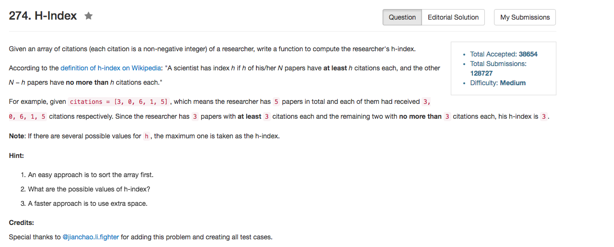

## Algorithm 

- 最直接的想法是排序，然后找到第`i`个位置，如果`citations[i] >= i`，那就是结果了，时间复杂度O(NlogN)。
- 当然，考虑到最大的可能结果是`n`，因为只发了`n`篇文章，那么可以统计`citation`从`0 - n`的文章分别有多少，如果`citation > n`，那么就直接认为`citation == n`就好了，反正也没有更多的贡献。
    1. 统计`citation`为`i`的文章个数
    2. 统计`citation >= i`的文章个数，这个基于1的结果求一个部分和就好了
    3. 找到`i`位置，`citationSum[i] >= i`
    4. 时间复杂度O(N)

## Comment

- 题目给了提示，可以使用extra space。这里的快速的解法，空间复杂度是O(N)的。

## Code

```C++
class Solution {
public:
    int hIndex(vector<int>& citations) {
        int n = citations.size();
        vector<int> count(n + 1);
        for (int i = 0; i < n; i++) count[min(n, citations[i])]++;
        for (int i = n - 1; i >= 0; i--) count[i] += count[i + 1];
        for (int i = n; i >= 0; i--) 
            if (count[i] >= i) return i;
        return 0;
    }
};
```
