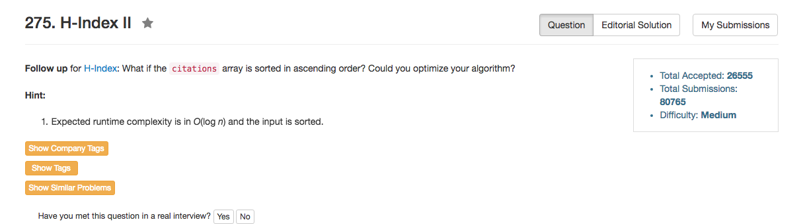

## Algorithm 

- 没什么好说的，就是二分查找。
- 只是条件是`n - mid <= citations[mid]`，如果满足的话，`n - mid`就是一个解，然后在调整左右指针就好了。
- 二分又是没有能够一次写对！！！
- 返回的答案要注意，是`n - mid`，而不是`mid`。

## Comment

- 二分，不是那么容易写对的！

## Code

```C++
class Solution {
public:
    int hIndex(vector<int>& citations) {
        int n = citations.size(), left = 0, right = n - 1, ans = 0; 
        while (left <= right){
            int mid = left + (right - left) / 2;
            if (n - mid <= citations[mid]){
                ans = n - mid;
                right = mid - 1;
            } else {
                left = mid + 1;
            }
        }
        return ans;
    }
};
```
