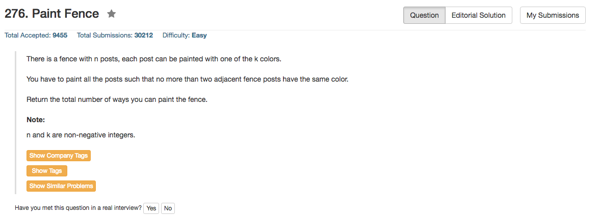

## Algorithm 

- 非常直白的动态规划
	- 设`same[i]`表示截止到第i个数且`color[i] == color[i-1]`，有多少种情况
	- 设`diff[i]`表示截止到第i个数且`color[i] != color[i-1]`，有多少种情况
	- 状态转移方程如下：
		1. `same[i] = diff[i - 1]` 
		2. `diff[i] = (same[i - 1] + diff[i - 1]) * (k - 1)`
	- 边界条件：
		1. `k == 0`或者`n == 0`的话，结果都是0。
		2. `same[0] = 0; diff[0] = k`
	- 最后的结果：`same[n] + diff[n]`

## Comment

- 当然，由于i-1之前的状态都不需要保留，所以程序实现的时候并不需要保存一个数组，只要记录上一次的same和diff的值就好了。这样的话空间复杂度就是O(1)的，时间复杂度是O(N)

## Code

```c++
class Solution {
public:
    int numWays(int n, int k) {
        if (n == 0 || k == 0) return 0;
        int oldSame = 0, oldDiff = k, newSame = 0, newDiff = 0;
        for (int i = 1; i < n; i++){
            newSame = oldDiff;
            newDiff = (oldDiff + oldSame) * (k - 1);
            oldSame = newSame;
            oldDiff = newDiff;
        }
        return oldSame + oldDiff;
    }
};
```