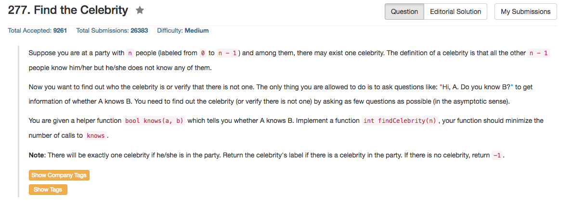

## Algorithm 

- 这个题目我真的不确定我是对的，或者是最优的。但是根据discussion里面的讨论来说，大家的思路都差不多。
- 基本思路都是two pass: 第一遍找到一个celebrity的候选人，第二遍check这个人是不是celebrity。由于第二个步骤很容易懂，而且大家都没有选择什么特别的判断，所以就不赘述了，这里说第一步怎么坐
    1. 大多数人的做法是拿当前的`celebrity`跟当前的`i`号人比，如果`knows(celebrity, i) == true`，那当前的`celebrity`肯定不是真正的`celebrity`，直接把候选人换做`i`；否则候选人不变。—— 这样的话是稳定的O(N)，数组一遍就好了。
    2. 我想得比较多，结果反而不是最优的。我是想每两个人比较：如果`knows(a, b)`和`knows(b, a)`同真同假，则`a, b`都不是celebrity，否则其中有一个是候选人，然后再拿这个候选人跟别人比。—— 我这样第一遍扫一次就是O(2 * N)的，询问次数多了一倍，不是好算法。

## Comment

- 最后发现还不如最朴素的方法。其实直接two pass的算法蛮容易想的。
- 还有没有更优的算法？好像是没有了

## Code

Two Pass直接算，很好懂，C++程序来自[这里](https://discuss.leetcode.com/topic/23519/5-line-c-solution)。这个版本写的相当紧凑，其实展开以后很好懂。这个程序强行收缩到5行其实并没有必要，不是很方便阅读，也不是很美观。

```C++
int findCelebrity(int n) {
    if(n<2) return n ? 0 : -1;
    int curr = 0, next = 1;
    for(;next<n;next++) if(knows(curr,next)) curr = next;
    for(int i=0; i<n; i++) if(curr != i && (knows(curr, i) || !knows(i, curr))) return -1;
    return curr;
}
```

我的算法，想得比较多

```C++
//Forward declaration of the knows API.
bool knows(int a, int b);

class Solution {
public:
    int findCelebrity(int n) {
        if (n == 1) return -1;
        int celebrity = 0, visitor = 1;
        while (visitor < n){
            bool know1 = knows(celebrity, visitor);
            bool know2 = knows(visitor, celebrity);
            if (know1 ^ know2){
                celebrity = (know1) ? visitor : celebrity;
                visitor = visitor + 1;
            } else {
                celebrity = visitor + 1;
                visitor = visitor + 2;
            }
        }
        if (celebrity >= n) return -1;
        for (int i = 0; i < n; i++){
            if (i != celebrity && !(knows(i, celebrity) == true && knows(celebrity, i) == false)) 
                return -1;
        }
        return celebrity;
    }
};
```
