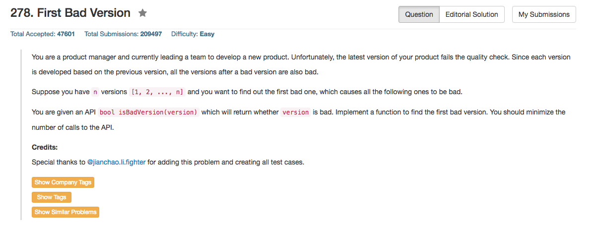

## Algorithm 

- 就是一个二分查找，但是正如某个note里面说的，世界上能一次写对二分查找的人其实不多——我就没有能够一次写对。
- 需要注意的是`mid = (left + right) / 2`实际上是一个非常危险的写法，因为这样写可能会**overflow**，然后就变成一个诡异的结果。`mid = left + (right - left) / 2`这样写就会比较好地防止overflow的问题。
- 另外`while (left <= right)`这个条件跟初始值以及程序中的选择都有关系，一定要注意。我一开始没有能够找出这个错误，迷惑了很久很久。

## Comment

- 依然是c++的vector和unordered_map的操作，[这里](https://leetcode.com/discuss/103787/table-solution-pointers-solution-with-time-space-complexity)关于C++实现`unordered_map`的空间复杂度的讨论值得注意，理解为什么算法1和算法2的空间复杂度是不一样的。
- Two pointer的方法还挺有意思的，我写了一个。

## Code

```C++
// Forward declaration of isBadVersion API.
bool isBadVersion(int version);

class Solution {
public:
    int firstBadVersion(int n) {
        int left = 1, right = n, ans = -1, mid;
        while (left <= right){ //这个一开始写成了left < right，结果错了很久
            mid = left + (right - left) / 2;
            if (!isBadVersion(mid)) {
                left = mid + 1;
            } else {
                ans = mid;
                right = mid - 1;
            }
        }
        return ans;
    }
};
```
