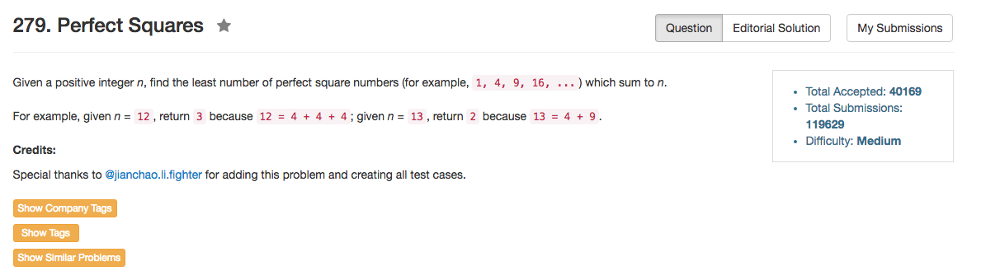

## Algorithm 

- 怎么说呢，这个题目除了数学解，其他的解法都存在TLE或者MLE的问题。在[这里](https://discuss.leetcode.com/topic/24255/summary-of-4-different-solutions-bfs-dp-static-dp-and-mathematics)综述了四个不同的解法，除了数学解，对于测试数据24497318来说都会TLE，当然，我的结果也是TLE了。但是我最后还是过了这里的数据，为什么呢？因为数据比较小……
- 非数学解有很多种方法，比如BFS，DP，static DP
	1. BFS：广搜应该是非常直接的一个选择，从n出发，依次加入`n-i*i`的状态，并且不断加入新的状态。第一次到达`0`的时候找到了结果，此时距离`n`的状态的步长也就是最优解。
	2. DP和static DP，这个也很容易想`F[n] = min(F[n - i * i]), i = 1 ... sqrt(n)`，慢慢更新不同的F[n]就好了。static DP这里可以定义DP这个数组是static，所以内存中的内容不会丢失，第二次调用函数的时候，直接看状态是不是已经在之前的调用中计算过了，如果计算过了就直接返回`F[n]`就好了。[这里](https://discuss.leetcode.com/topic/23812/static-dp-c-12-ms-python-172-ms-ruby-384-ms)给了解释
- 数学解是[Lagrange's four-square theorem](https://en.wikipedia.org/wiki/Lagrange%27s_four-square_theorem), [这里](https://discuss.leetcode.com/topic/23906/o-sqrt-n-about-0-034-ms-and-0-018-ms/2)给出了简洁的解释和Python的程序，最上面的那个综述的结果也提到了数学解
	0. 一个整数最多可以写成4个平方数的和
	1. 如果这个数本身是平方数，结果是1个
	2. 如果这个数本身是4^a(8x + 7)，结果是4个
	3. 然后看这个数能不能写成2个平方数的和，如果可以，答案是2；否则，答案是3.

## Comment

- 这个背后的数学知识，如果不知道，那就老老实实写BFS或者DP吧。

## Code

广搜的解

```C++
class Solution {
public:
    int numSquares(int n) {
        std::unordered_set<int> visited;
        queue<vector<int>> BFS;
        BFS.push({n, ceil(sqrt(n)), 0});
        int count = 0;
        while (BFS.size()){
            vector<int> state = BFS.front();
            BFS.pop();
            for (int i = state[1]; i > 0; i--){
                if (i * i == state[0]) {
                    return state[2] + 1;
                } else if (i * i < state[0] && visited.count(state[0] - i * i) == 0) {
                    BFS.push({state[0] - i * i, i, state[2] + 1});
                    visited.insert(state[0] - i * i);
                }
            }
        }
        return -1;
    }
};
```

[这里](https://discuss.leetcode.com/topic/23812/static-dp-c-12-ms-python-172-ms-ruby-384-ms)提到的static动态规划的解，相当于用一个static把过去计算的结果存到了内存中，所以第二次调用的时候只需要计算那些之前没有计算过的元素。但是这个程序真的是写的非常有意思。

```C++
int numSquares(int n) {
    static vector<int> dp {0};
    while (dp.size() <= n) {
        int m = dp.size(), squares = INT_MAX;
        for (int i=1; i*i<=m; ++i)
            squares = min(squares, dp[m-i*i] + 1);
        dp.push_back(squares);
    }
    return dp[n];
}
```

[这里](https://discuss.leetcode.com/topic/23906/o-sqrt-n-about-0-034-ms-and-0-018-ms/2)提到的数学解，用Python写的

```Python
int numSquaresReal(int n) {
    while (n % 4 == 0)
        n /= 4;
    if (n % 8 == 7)
        return 4;
    int a = -1, b = sqrt(n);
    n -= b * b;
    b += b + 1;
    while (a <= b) {
        if (n < 0)
            n += b -= 2;
        else if (n > 0)
            n -= a += 2;
        else
            return a < 0 ? 1 : 2;
    }
    return 3;
}
```