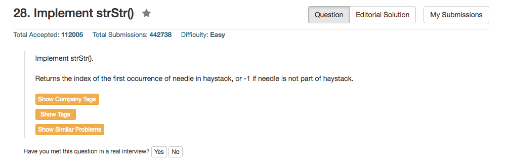

## Algorithm 

- 这个题目数据太弱了，直接暴力算法就可以很快过所有数据。
- 当然要写一个KMP看看是不是会这种经典算法咯。
- 当然找字符串匹配还有很多其他经典算法。

## Comment

- 需要注意的是，如果needle是""，也就是空串，那么返回到答案是0。
- 关于needle是空串的返回值，这种边界条件一定要记得问面试官怎么定义，这种问题很蛋疼，但是也很重要。

## Code

暴力算法

```c++
class Solution {
public:
    int strStr(string haystack, string needle) {
        if (needle.size() == 0) return 0;
        for (int i = 0; i < haystack.size(); i++)
            for (int j = 0; j < needle.size(); j++){
                if (haystack[i+j] != needle[j]) break;
                if (j == needle.size() - 1) return i;
                if (i + j == haystack.size() - 1) return -1;
            }
        return -1;
    }
};
```

KMP算法

TO-DO