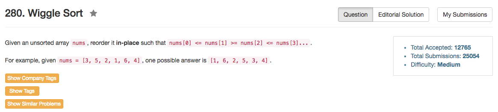

## Algorithm 

- 其实我觉得这个题目挺难的。看了别人的答案之后发现自己傻逼了，我想的算法非常难以实现，而且还有很多边界条件。
- [这里](https://discuss.leetcode.com/topic/23877/4-lines-o-n-c/2)讲的特别对：
    1. 如果`i is odd`，那么必须`nums[i] >= nums[i - 1]`
    2. 如果`i is even`, 那么必须`nums[i] <= nums[i - 1]`
    3. 如果不满足，那么交换`nums[i]`和`nums[i - 1]`
- 为什么上面的方法能行呢？
    1. 如果`i is odd`, `nums[i] < nums[i - 1]`，这个时候就会是`nums[i - 2] >= nums[i - 1] > nums[i]`。根据不等式的传递性，`nums[i - 2] >= nums[i]`。所以即使`nums[i]`和`nums[i - 1]`调换，之前的不等式仍然成立。调换后，`nums[i] > nums[i - 1]`了。这样，连续两个不等式都成立。 
    2. 如果`i is even`, `nums[i] > nums[i - 1]`, 这个时候就会是`nums[i - 2] <= nums[i - 1] < nums[i]`。根据不等式的传递性，`nums[i - 2] < nums[i]`。所以即使`nums[i]`和`nums[i - 1]`调换，之前的不等式仍然成立。调换后，`nums[i] <= nums[i - 1]`了。这样，连续两个不等式都成立。 
- 所以这个就是O(N)的解法。

## Comment

- 这个题目一开始想得太复杂。知道解法以后发现好容易。

## Code


```C++
class Solution {
public:
    void wiggleSort(vector<int>& nums) {
        int n = nums.size();
        for (int i = 1; i < n; i++){
            if ( ((i & 1) && nums[i] < nums[i - 1]) || (!(i & 1) && nums[i] > nums[i - 1])){
                swap(nums[i], nums[i - 1]);
            }
        }
    }
};
```

[这里](https://discuss.leetcode.com/topic/23877/4-lines-o-n-c/3)的更简洁的写法如下

```C++
void wiggleSort(vector<int>& nums) {
    for (int i=1; i<nums.size(); ++i)
        if (i%2 == (nums[i-1] > nums[i]))
            swap(nums[i-1], nums[i]);
}
```
