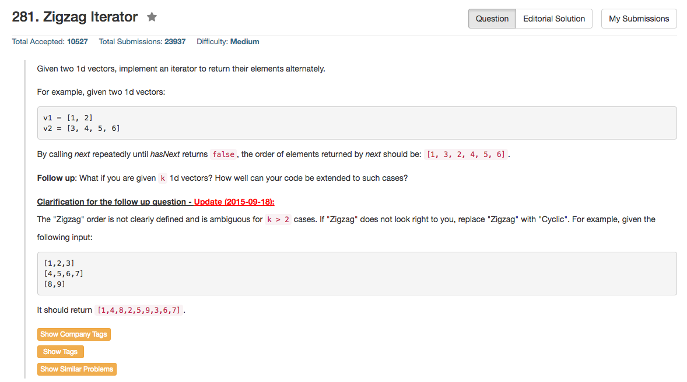

## Algorithm 

- 这个题目又是一个需要学习C++的高级数据结构，包括vector, queue, pair和iterator的题目。
- 其实思路倒是不难，最好的、最优普遍性的解法来自[这里](https://leetcode.com/discuss/58683/c-with-queue-compatible-with-k-vectors):
    1. 用一个队列来记录还没有遍历完的数组
    2. 如果队首所在的数组访问了一次，那么把这个数组出队。
    3. 如果刚刚出队的那个数组没有被遍历完，那么加入到队尾。
    4. 继续2，直到队列为空。
    5. 这种算法自然地、按顺序循环访问了每一个数组，因为每一个数组都会在队列一次，然后重新排队，进入队尾。
    6. 当然，所谓『数组出队、入队』这些方法本质上是通过用对应的`iterator`来实现的。


## Comment

- 用iterator来遍历vector等高级数据结构，是C++中一个重要的基本功的样子。这个题目很好的对这个方面进行了训练。不过不知道其他语言，如果没有iterator，或者iterator不是这么做的，会怎么办呢？
- 我觉得可以想到的是C里面可以用指针，前提在于我们知道整个数组的长度，不然也不是很好写。

## Code

这个版本来自上面所提到的页面，用`queue`这个数据结构加上`pair`这个数据结构很干净地将整个问题解决了，我觉得写得很不错。

```c++
class ZigzagIterator {
public:
    ZigzagIterator(vector<int>& v1, vector<int>& v2) {
        if (v1.size() != 0)
            Q.push(make_pair(v1.begin(), v1.end()));
        if (v2.size() != 0)
            Q.push(make_pair(v2.begin(), v2.end()));
    }

    int next() {
        vector<int>::iterator it = Q.front().first;
        vector<int>::iterator endIt = Q.front().second;
        Q.pop();
        if (it + 1 != endIt)
            Q.push(make_pair(it+1, endIt));
        return *it;
    }

    bool hasNext() {
        return !Q.empty();
    }
private:
    queue<pair<vector<int>::iterator, vector<int>::iterator>> Q;
};
```


我写的用vector的版本，省了频繁的`queue.pop()和queue.push()`，于是也就使用了一个arrayId来记录到底访问到了哪一个数组。另外，为了防止所有的数组都已经结束了的情况，我记录了一个`count`。如果`count == 2`，说明两个数组都被访问过了，只是两个数组都已经遍历完了而已，于是就可以退出查找下一个位置的循环了。

```c++
class ZigzagIterator {
public:
    ZigzagIterator(vector<int>& v1, vector<int>& v2) {
        it.push_back({v1.begin(), v1.end()});
        it.push_back({v2.begin(), v2.end()});
    }

    int next() {
        return *(it[arrayId].first)++;
    }

    bool hasNext() {
        arrayId = 1 - arrayId;
        int count = 0;
        while (count < 2 && it[arrayId].first == it[arrayId].second){
            arrayId = (arrayId + 1) % 2;
            count++;
        }
        return it[arrayId].first != it[arrayId].second;
    }
private:
    vector<pair<vector<int>::iterator, vector<int>::iterator>> it;
    int arrayId = 1;
};
```