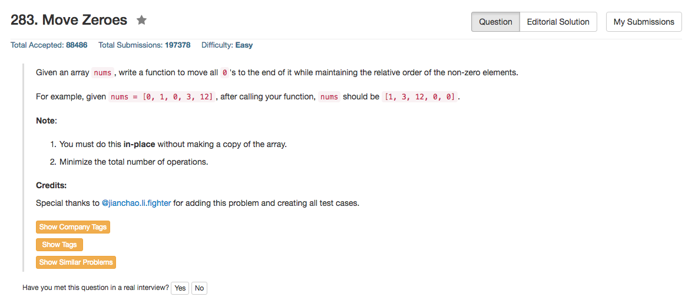

## Algorithm 

- 一种算法是用fast和slow两个指针，如果`nums[fast]`不是0，那么就把`nums[slow++] = nums[fast]`，换句话说就是每次找到一个非0的数，就让slow指针记录下来，这样的话就slow指针就按顺序记录了所有非0的数。最后就是让数组剩下的位置都填充0了。
- 另一种算法，比如看[这里](https://leetcode.com/discuss/59064/c-accepted-code)，本质上跟第一种算法很像，唯一的差距在于这种算法不是直接覆盖，而是每次看到一个非0的数就swap一次数组的元素。
- 结果要求运算次数最少，我们对比一下上面两种算法，到底swap运算少还是直接覆盖运算少
    - 除掉同样的判断语句和增值语句，第一种算法每次要进行1次赋值，第二种算法每一次swap需要有3次赋值。
    - 如果是[0,0,0,0,1,0]，算法一有6次运算(6次赋值)，算法二只有3次赋值(1次交换)
    - 如果是[0,0,0,1,1,1]，算法二有6次运算(6次赋值)，算法二有9次赋值(3次交换)
    - 所以看起来算法一好一些

## Comment

- 又是一个slow/fast pointer的应用。

## Code

```c++
class Solution {
public:
    void moveZeroes(vector<int>& nums) {
        int slow, fast;
        for (fast = 0, slow = 0; fast < nums.size(); fast++){
            if (nums[fast]) nums[slow++] = nums[fast];
        }
        while (slow < nums.size()) nums[slow++] = 0;
    }
};
```