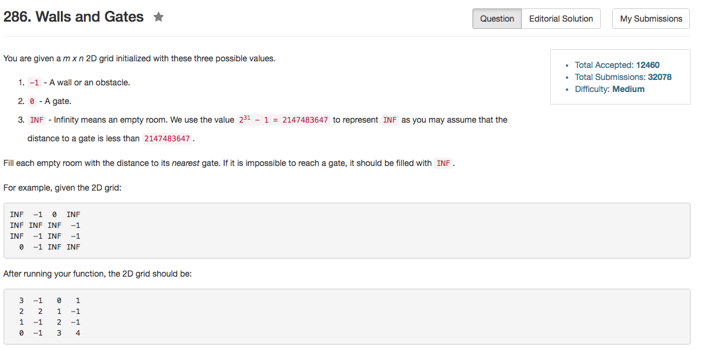

## Algorithm 

- 这题目也没什么好说的，直接BFS统计一遍就可以了。

## Comment

- pair还是不是那么容易用啊。

## Code

```C++
class Solution {
public:
    void wallsAndGates(vector<vector<int>>& rooms) {
        queue<pair<int, int>> BFS;
        vector<pair<int, int>> direction = {{+1, 0}, {-1, 0}, {0, +1}, {0, -1}};
        if (rooms.size() == 0 || rooms[0].size() == 0) return;
        int n = rooms.size(), m = rooms[0].size();
        for (int i = 0; i < n; i++){
            for (int j = 0; j < m; j++){
                if (rooms[i][j] == 0){
                    BFS.push(pair<int, int>{i, j});
                }
            }
        }
        while (!BFS.empty()){
            pair<int, int> coor = BFS.front();
            BFS.pop();
            for (int i = 0; i < direction.size(); i++){
                pair<int, int> nextLoc = {coor.first + direction[i].first, coor.second + direction[i].second};
                if (nextLoc.first >= 0 && nextLoc.first < n && nextLoc.second >= 0 && nextLoc.second < m 
                 && rooms[nextLoc.first][nextLoc.second] == INT_MAX){
                     rooms[nextLoc.first][nextLoc.second] = rooms[coor.first][coor.second] + 1;
                     BFS.push(nextLoc);
                 }
            }
        }
    }
};
```
