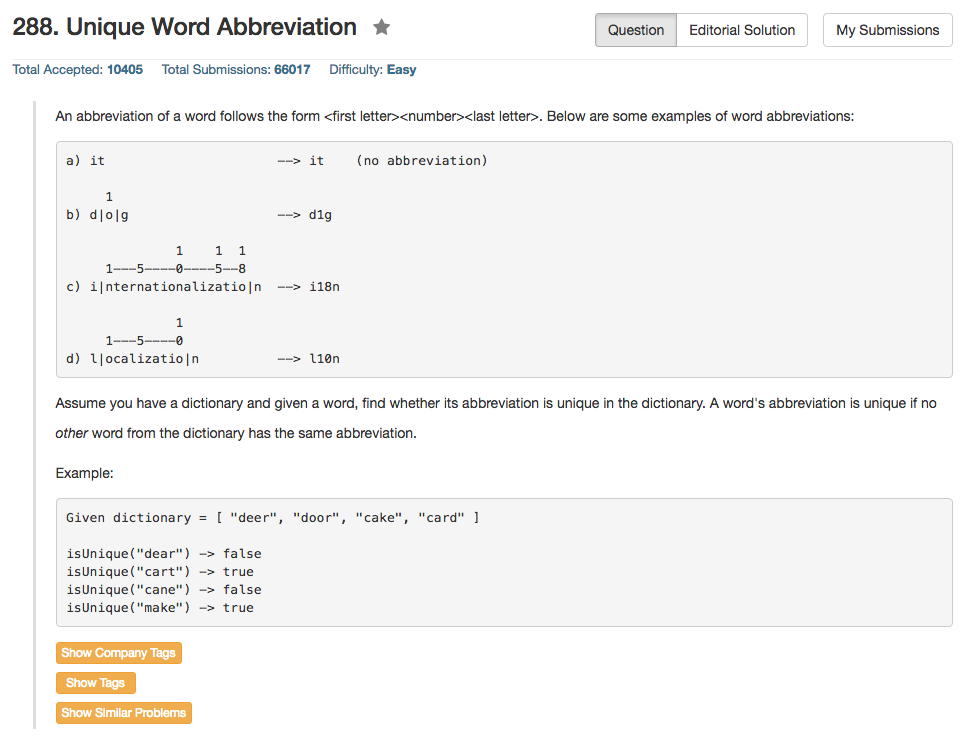

## Algorithm 

- 这个题目，关于题目的意思，需要多说几句。这个题目最终就是要问，在dictionary里面，是否存在一个跟word缩写一样，却又不是word的词。
    1. 如果dictionary里面不存在跟word缩写一样的词，那么显然，word是unique
    2. 如果dictionary里面存在跟word缩写一样的词，但是这个词就是word，那么word也是unique
    3. 如果dictionary里面存在跟word缩写一样的词，但是这个词不是word，那么word终于不是unique的了
- C++的算法我用了`unordered_map`来匹配一个缩写及其对应的单词，当然，如果同一个缩写在dictionary里面对应好几个词，这个缩写就会对应'_DUPLICATE_'这个词，我假设这个词不可能是任何word或者dictionary里面的词。

## Comment

- 题目意思不是很清楚，遇到的时候需要多问一下面试官，跟面试官确认题目的意思才行。

## Code

```c++
cclass ValidWordAbbr {
private:
    std::unordered_map<string, string> hash;
public:
    ValidWordAbbr(vector<string> &dictionary) {
        for (int i = 0; i < dictionary.size(); i++){
            string shortform = shorten(dictionary[i]);
            if (hash.count(shortform) == 0 || hash[shortform] == dictionary[i]){
                hash[shortform] = dictionary[i];
            } else {
                hash[shortform] = "_DUPLICATE_";
            }
        }
    }

    bool isUnique(string word) {
        string shortform = shorten(word);
        return hash.count(shortform) == 0 || hash[shortform] == word;
    }
    
    string shorten(string origin){
        return (origin.size() > 2) ? origin[0]+to_string(origin.size() - 2)+origin[origin.size()-1]:origin;
    }
};

```

另一种用C++的解法，来自[这里](https://leetcode.com/discuss/61546/8-lines-in-c)，使用了`<string, unordered_set<string>>`这样的搭配，思路其实差不多，感觉我的算法在空间上要稍微优化一些。

```c++
class ValidWordAbbr {
public:
    ValidWordAbbr(vector<string> &dictionary) {
        for (string& d : dictionary) {
            int n = d.length();
            string abbr = d[0] + to_string(n) + d[n - 1];
            mp[abbr].insert(d);
        }
    }

    bool isUnique(string word) {
        int n = word.length();
        string abbr = word[0] + to_string(n) + word[n - 1];
        return mp[abbr].count(word) == mp[abbr].size(); 
    }
private:
    unordered_map<string, unordered_set<string>> mp;
};

```