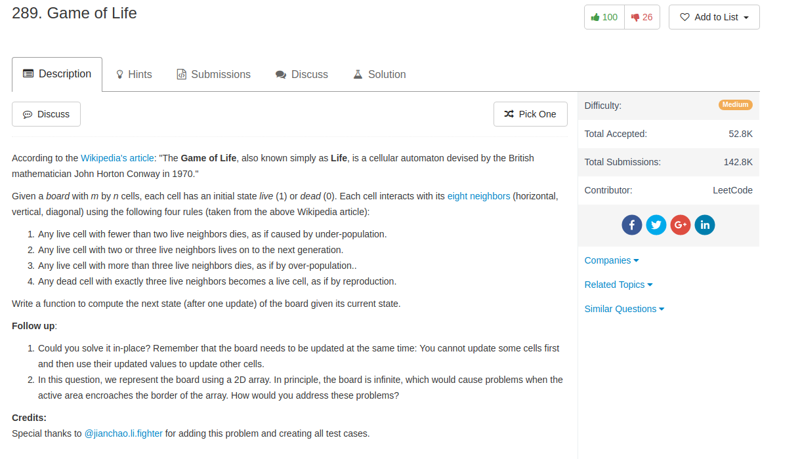

## Algorithm

- 这题目直接做是完全没有难度的，就是稍微判断一下边界条件
- 但是这题要求in-place更新，这就有点难度了。我想了很多种办法，但是最后发现最简单的办法是用一个独立的bit来记录新的信息，最后更新一下就好了。这个还是很厉害的，从StefanPochmann那里学的。

## Comment

- bit-operation还是自有妙用

## Code


```python
class Solution(object):
    def gameOfLife(self, board):
        """
        :type board: List[List[int]]
        :rtype: void Do not return anything, modify board in-place instead.
        """
        direction = [(0, 1), (1, 1), (1, 0), (1, -1), (-1, 0), (-1, -1), (0, -1), (-1, 1)]
        n, m = len(board), len(board[0])
        for i in range(n):
            for j in range(m):
                count = 0
                for dx, dy in direction:
                    if i + dx >= 0 and i + dx < n and j + dy >= 0 and j + dy < m and board[i + dx][j + dy] % 2 == 1:
                        count = count + 1
                if (board[i][j] == 1 and count in [2, 3]) or (board[i][j] == 0 and count == 3):
                    board[i][j] += 2
        for i in range(n):
            for j in range(m):
                board[i][j] = board[i][j]  >> 1

```
