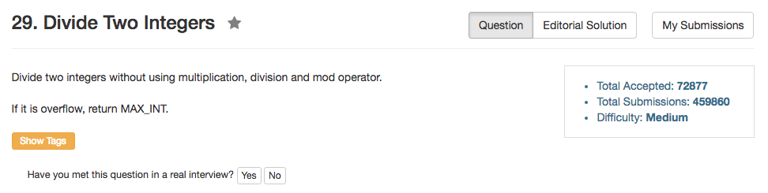

## Algorithm 

- 这个题目思路其实不难，就是不断地找到divisor的1倍、2倍、4倍、8倍...然后在用dividend依次去减就好了。最后的答案就是可以用二进制算出来。
- 比如，`dividend = 32 * divisor + 8 * divisor + 1 * divisor`，那么最后结果就是`32+8+1 = 41`
- 我这里是用了一个`vector`把相关的倍数结果都存起来了。其实也可以不存起来。不存起来的话可能就是O((logN)^2)的方法了。
- 当然，其实可以用log直接算。[这里]()罗列了很多种不同的方法。

## Comment

- 这个题目overflow各种边界需要小心
- 比如`dividend == INT_MIN && divisor == -1`和`divisor == 0`这两种都是溢出，但是显然我一开始并没有考虑到前面一种。
- 另外，在`1 << k`的时候也可能会溢出，我一开始也没有考虑到。

## Code

我的比较长而丑的答案。

```C++
class Solution {
public:
    int divide(int dividend, int divisor) {
        if (divisor == 0 || (dividend == INT_MIN && divisor == -1))
            return INT_MAX;
        vector<long long> divisorMultiple;
        long long sign = (dividend > 0) + (divisor > 0) == 1 ? -1 : 1;
        long long m = abs((long long)dividend);
        long long n = abs((long long)divisor);
        long long ans = 0;
        divisorMultiple.push_back(n);
        while (n + n <= m) {
            n += n;
            divisorMultiple.push_back(n);
        }
        while (divisorMultiple.size()){
            if (m >= divisorMultiple.back()) {
                m -= divisorMultiple.back();
                ans += (long long) 1 << (divisorMultiple.size() - 1);
            }    
            divisorMultiple.pop_back();
        }
        return sign * ans < INT_MAX ? sign * ans : INT_MAX;
        
    }
};
```

比较好的写法

```C++
class Solution {
public:
    int divide(int dividend, int divisor) {
        long long result=0;
        long long m=abs((long long)dividend);
        long long n=abs((long long)divisor);
        while(m>=n){
            long long s=n, power=1;
            while((s<<1) <= m) { s<<=1; power<<=1; }
            result+=power;
            m-=s;
        }
        
        if( (dividend>0) ^ (divisor>0))  result = -result;
        return result>INT_MAX ? INT_MAX:result;
    }
};
```

直接用log的写法

```C++
 class Solution {
    public:
        int divide(int dividend, int divisor) {
            /** a/b = e^(ln(a))/e^(ln(b)) = e^(ln(a)-ln(b)) **/
            if(dividend==0)  return 0;
            if(divisor==0)  return INT_MAX;
            
            double t1=log(fabs(dividend));
            double t2=log(fabs(divisor));
            long long result=double(exp(t1-t2));
            if((dividend<0) ^ (divisor<0))  result=-result;
            if(result>INT_MAX)  result=INT_MAX;
            return result;
        }
    };
```