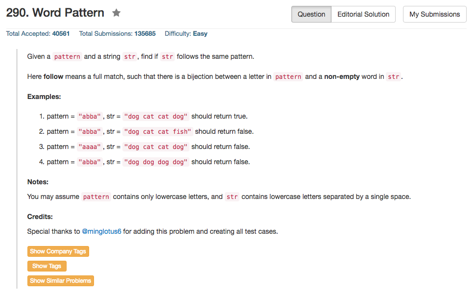

## Algorithm 

- 这个题目最本质的仍然是一个1-1映射的问题，解决的办法可以是两个Hash表左右映射判断是不是一致，也可以是两个Hash表把两个变量同时映射到第三个变量上——比如把char和对应的字符串s映射到同一个pattern位置。
- 但是这个题目麻烦的地方在于字符串操作
    1. 通过空格找到单词
    2. 有可能单词和pattern字符不是一一对应的，比如a->word1, a->word2; a->word1, b->word1
    3. 有可能字符串走完了pattern还没有走完
    4. 有可能pattern串走完了，字符串没有走完。

## Comment

- 总之我的程序，虽然是通过了，但是写的很丑。
- [这里](https://leetcode.com/discuss/62476/short-c-read-words-on-the-fly)这个解法程序就非常优美，但是有很多部分需要理解的
    1. `istringstream`这个数据类型就不明白
    2. `in >> word`这个手段也不是很明白

## Code

我的程序，很难看，我都不确定测试数据有没有考虑到所有可能的情况

```c++
class Solution {
public:
    bool wordPattern(string pattern, string str) {
        std::unordered_map<string, int> hashString;
        std::unordered_map<char, int> hashChar;
        string tmp = "";
        str = str + " ";
        int i, iPattern;
        for (i = 0, iPattern = 0; i < str.size() ; i++){
            if (str[i] == ' '){
                if (tmp.size()){
                   if (hashString[tmp] == hashChar[pattern[iPattern]]){                        hashString[tmp] = iPattern + 1;
                        hashChar[pattern[iPattern]] = iPattern + 1;
                        iPattern ++;
                    } else {
                        return false;
                    }
                }
                while (str[i] == ' ') i++;
                if (i < str.size()){
                    tmp = str[i];
                } else {
                    tmp = "";
                };
            } else {
                tmp = tmp + str[i];
            }
        }
        return iPattern == pattern.size();
    }
};
```

这个是网上的程序，优美很多，来自[这里](https://leetcode.com/discuss/62476/short-c-read-words-on-the-fly)

```c++
bool wordPattern(string pattern, string str) {
    map<char, int> p2i;
    map<string, int> w2i;
    istringstream in(str);
    int i = 0, n = pattern.size();
    for (string word; in >> word; ++i) {
        if (i == n || p2i[pattern[i]] != w2i[word])
            return false;
        p2i[pattern[i]] = w2i[word] = i + 1;
    }
    return i == n;
}
```