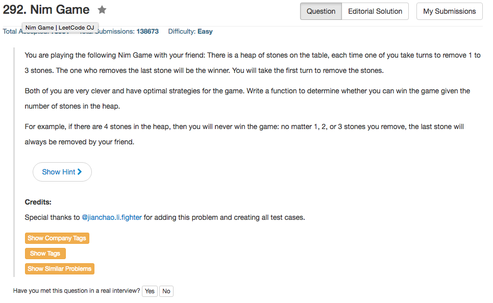

## Algorithm 

- 这本质上也是个数学题，基本上就是：考虑自己能不能让对方陷入到一个必败局面。

<pre>
NUM:  1  2  3  4  5  6  7  8  9  10
WIN:  T  T  T  F  T  T  T  F  T  T 
</pre>

当我们有5,6或者7个的石子的时候，我们可以拿走1,2或者3颗石子，使得对方剩下4颗石子，而这个局面是个必败局面。我们导致对手必败，所以我们所在的局面就是必胜局面。以此类推

## Comment

- 这个题目都不值得用超过一种语言写，因为本质上所有语言都可以用桶一条语句。

## Code

```C
bool canWinNim(int n) {
    return n % 4 > 0;
}
}```

